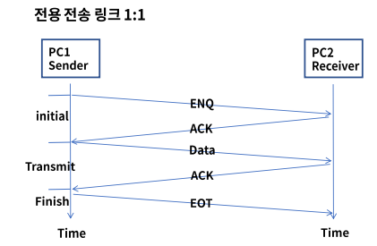
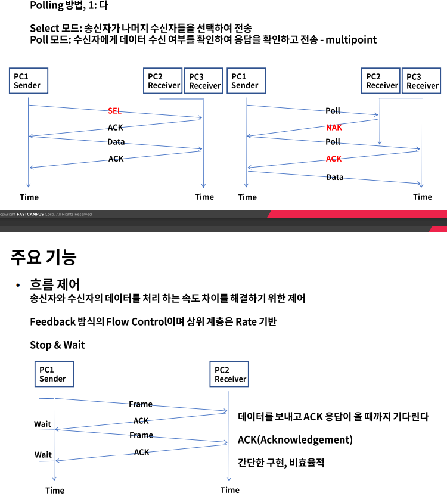
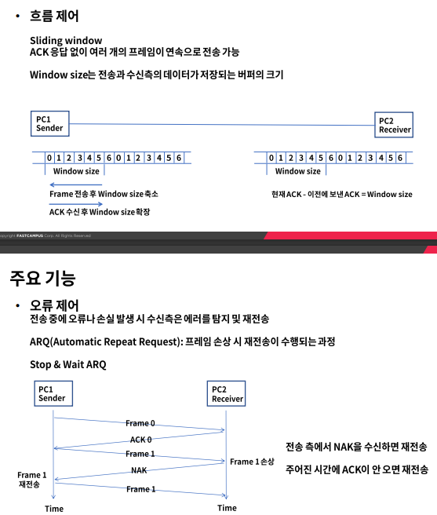
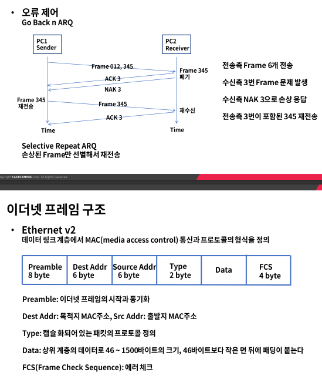

# 데이터 링크 계층의 역할과 기능

### 데이터 링크 계층?

- 역할

  OSI 7 Layer의 2계층으로 인접한 네트워크 노드끼리 데이터를 전송하는 기능과 절차를 제공

  물리계층에서 발생할 수 있는 오류를 감지하고 수정

  대표적인 프로토코로 이더넷이 있으며 장비로는 스위치가 있다

#### 2개의 부 계층으로 구성

- MAC

  물리적인 부분으로 매체간의 연결방식을 제어하고 1계층과 연결

- LLC

  논리적인 부분으로 Frame을 만들고 3계층과 연결

- MAC주소

  명령어 cmd>ipconfig/all 또는 네트워크 설정에서 확인

### 주요기능

- Framing

  데이터그램을 캡슐화하여 프레임 단위로 만들고 헤더와 트레일러를 추가

  헤더는 목적지, 출발지 주소 그리고 데이터 내용을 정의

  트레일러는 비트 에러를 감지

- 회선 제어

  신호간의 충돌이 발생하지 않도록 제어

  ENQ/ACK 방법

  전용 전송 링크 1:1

