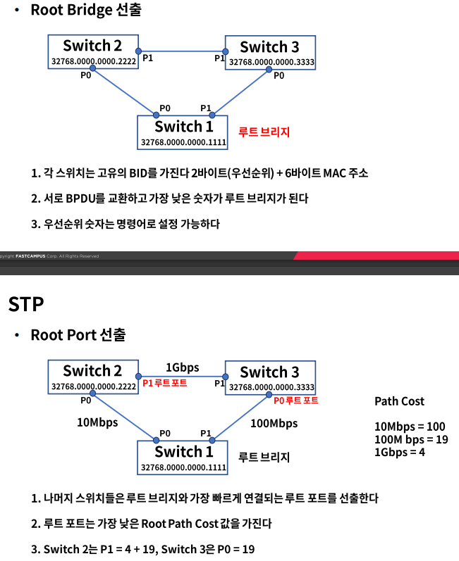
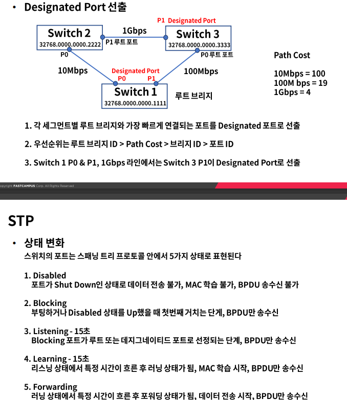

# 스패닝트리 프로토콜과 루핑

### Looping

- 정의
  - 같은 네트워크 대역 대에서 스위치에 연결된 경로가 2개 이상인 경우에 발생
  - PC가 브로드캐스팅 패킷을 스위치들에게 전달하고 전달 받은 스위치들은 Flooding을 한다.
  - 스위치들끼리 Flooding된 프레임이 서로 계속 전달되어 네트워크에 문제를 일으킨다.
  - 회선 및 스위치 이중화 또는 증축 등에 의해 발생
  - 물리적인 포트 연결의 실수 또는 잘못된 이중화 구성으로 L2에서 가장 빈번히 발생하는 이슈

