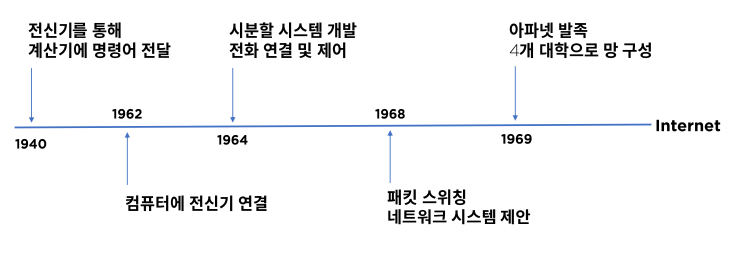
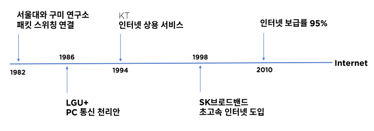
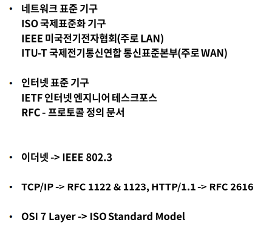

# 네트워크 소개

## 네트워크의 정의와 역사

- 네트워크란?
- 네트워크의 중요성
- 네트워크의 역사
- 네트워크 형태
- 네트워크 표준

### 네트워크란?

분산되어 있는 컴퓨터들이 자원을 공유할 수 있게 통신망으로 연결한 것

### 네트워크의 중요성

- 3차 산업혁명
  - 디지털 + 인터넷(공유) = 지식 정보화 사회 -> 급격한 기술의 발전
- 4차 산업혁명
  - 정보통신 기술의 융합 - 대표 요소 기술로 빅데이터, 인공지능, 사물인터넷 등
  - On Network - 대부분 요소 기술들은 네트워크 위에서 동작
  - 블록체인 기술은 신뢰 가능한 인터넷

### 네트워크 역사 - 미국

### 네트워크 역사 - 대한민국

### 네트워크 형태

- LAN(Local Area Network) 근거리 통신망

  - 사무실 또는 학교 드으이 가까운 지역을 한데 묶은 네트워크

- VPN(Virtual Private Network) 가상 사설망 공중망을 사설망처럼 사용, 암호화

- WAN(Wide Area Network) 장거리 통신망

  각각 떨어진 LAN망을 연결, 규모가 큰 네트워크, ISP로 연결

### 네트워크 표준

