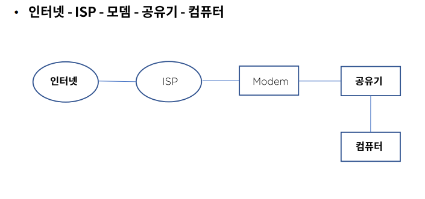
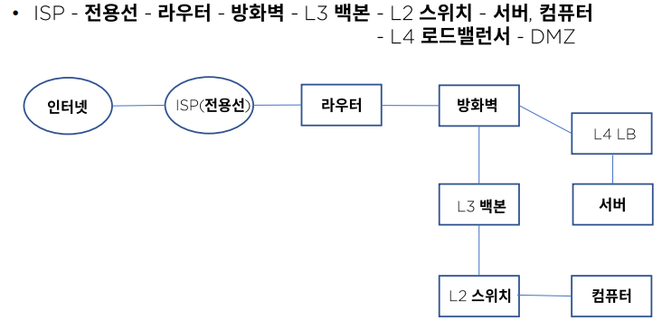
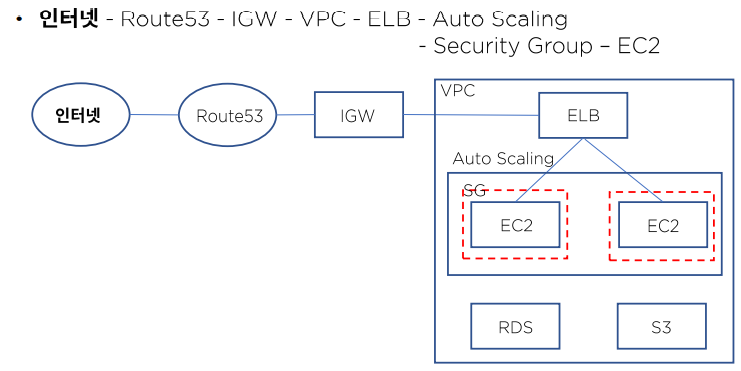

# 네트워크 구조

### 네트워크 구조

- 규모
  - 회사나 학교 등의 집단 크기에 따라 구분 - 사용자, 대역폭
- 업종
  - 공공기관, 제조, 금융, 게임 등의 업종에 따른 서비스 중요도
- 통신 방식과 경로
  - Server & Client, Peer to Peer
- 토폴로지
  - Star, Ring, Mesh, Bus, Tree, Redundancy

### 홈 네트워크

### 기업용 네트워크

### 클라우드 네트워크 - AWS 기준

