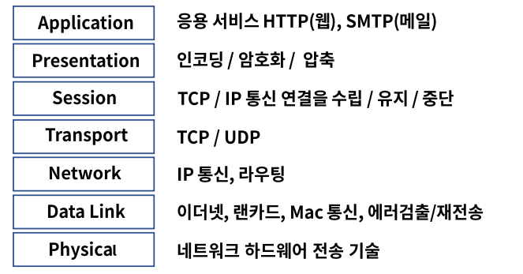

# OSI 7 Layer 모델

### OSI 7 Layer ?

- 정의

  - 네트워크 프로토콜과 통신을 7계층으로 표현

- 목적

  - 프로토콜을 기능별로 나누고 계층 별로 구분

    벤더간 호환성을 위한 표준 필요 -> 쉬운 접근성으로 기술의 발전

- 역사

  - 1970년대 초 네트워크는 정부 또는 특정 벤더에서 독점 개발, 공개 형 모델 필요
  - 1970년대 말 ISO(국제 표준화 기구)에 의해 관리
  - 1984년 ISO 7498 릴리즈

### OSI 7 Layer 모델

### 1계층 - Physical

- 기능
  - 장치와 통신 매체 사이의 비정형 데이터의 전송을 담당
  - 디지털 bit를 전기, 무선 또는 광 신호로 변환
  - 전송되는 방법, 제어 신호, 기계적 속성 등을 정의
  - 케이블, 인터페이스, 허브, 리피터 등이 이에 속함

### 2계층 - Data Link

- 기능
  - 동일 네트워크 내에서 데이터 전송, 링크를 통해서 연결을 설정하고 관리
  - 물리계층에서 발생할 수 있는 오류를 감지하고 수정
  - IEEE 820에서 정의
  - MAC(Media Access Control), LLC(Logical Link Control)
  - 모뎀, 스위치

### 3계층 - Network

- 기능
  - 다른 네트워크로 데이터 전송, IP주소로 통신
  - 출발지 IP에서 목적지 IP로 데이터 통신 시 중간에서 라우팅 처리
  - 데이터가 큰 경우 분할 및 전송 후 목적지에서 재 조립하여 메시지 구현
  - IP통신과 라우팅
  - L3스위치, 라우터

### 4계층 - Transport

- 기능
  - 호스트 간의 데이터 전송
  - 오류 복구 및 흐름 제어, 완벽한 데이터 전송을 보장
  - TCP/UDP
  - L4계층을 특정 하드웨어로 구분하기가 모호
  - Port를 제어한다는 의미로 L4 로드 밸런스가 있다.

### 5계층 - Session

- 기능
  - 로컬 및 원격 애플리케이션 간의 IP/Port연결을 관리
  - Session Table

### 6계층 - Presentation

- 기능
  - 사용자 프로그램과 네트워크 형식간에 데이터를 변환하여 표현과 독립성을 제공
  - 인코딩, 디코딩, 암호화, 압축
  - ASCII, JPG, MPEG

### 7계층 - Application

- 기능
  - 사용자와 가장 밀접한 소프트웨어
  - 이메일 서비스 SMTP, 또는 파일전송 FTP 등