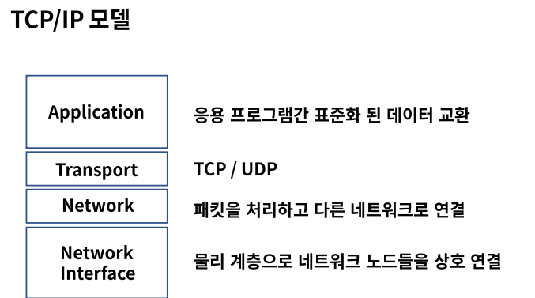
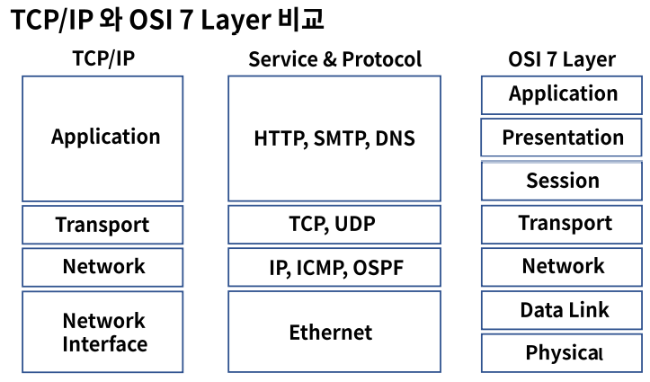
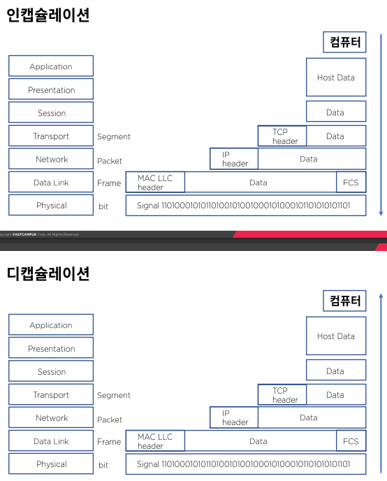

 # TCP/IP Suite 비교와 캡슐화

### TCP/IP ?

- 정의
  - 네트워크 프로토콜의 모음으로 패킷 통신 방식의 IP와 전송 조절 프로토콜인 TCP로 이루어져 있다.
- 역사
  - 1960년대 말 방위고등연구계획국이 연구
  - 1990년대 네트워크 표준이 ISO모델과 TCP/IP 모델로 좁혀짐
  - 1990년대 말 TCP/IP모델이 자주 쓰이면서 가장 일반적인 모델이 됨

