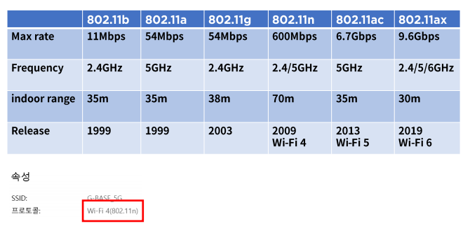

# 물리계층의 역할과 기능

### 물리계층이란?

- 역할
  - OSI 7 Layer의 1계층으로 하드웨어로 표현
  - 네트워크 장치의 전기적, 기계적 속성 및 전송하는 수단을 정의
  - 상위 계층인 데이터 링크 계층의 프레임을 신호로 인코딩하여 네트워크 장치로 전송
  - 통신 장치와 커넷터,인코딩,송수신을 담당하는 회로등의 요소가 있다.

### Signaling의 종류

- 전기
  - Copper 케이블을 사용하며 전화선, UTP, 동축케이블 등이 이에 속함
- 광
  - Optical Fiber 케이블이 이에 속하며 빛의 패턴을 신호로 사용
- IEEE 802.3

- 전파
  - 무선이 이에 속하며 마이크로파 패턴을 신호로 사용
- IEEE 802.11 무선랜 규격

- 방식
  - OSI 7 Layer 2계층의 Frame은 아래와 같은 형태로 전달

