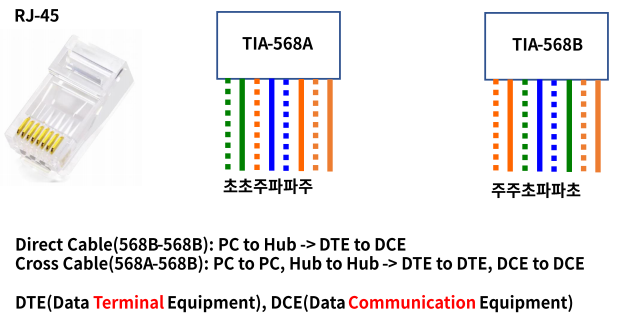
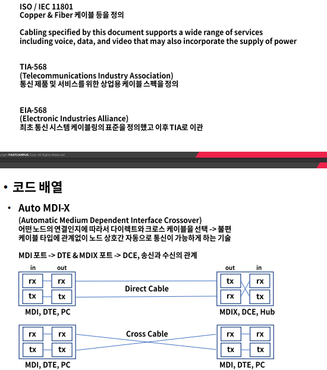
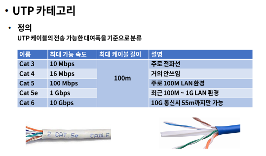
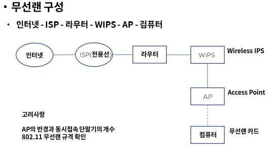

# UTP 케이블과 Wi-Fi

### UTP 케이블이란?

- 정의
  - Unshielded Twisted Pair, 주로 근거리 통신망(LAN)에서 사용되는 케이블
  - 이더넷 망 구성시 가장 많이 보게되는 케이블
  - 벨이 AT&T에서 발명

### 코드 배열

- 8P8C
  - 8개의 선 배열에 따라 다이렉트 또는 크로스 케이블로 구성

- Standard

### Wi-Fi란?

- 정의

  비영리 기구인 Wi-Fi Aliance의 상표로 전자기기들이 무선랜에 연결할 수 있게 하는 기술

  1999년 몇몇 회사들이 브랜드에 상관 없이 무선 네트워킹 기술의 발전을 위해 협회 결성

  2000년 Wi-Fi 용어 채택

  수십개 나라에서 수백개 회사가 참여

  802.11n Wi-Fi 4, 802.11ac Wi-Fi 5, 802.11ax Wi-Fi 6로 불림

