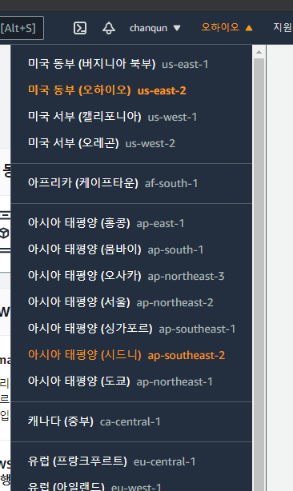
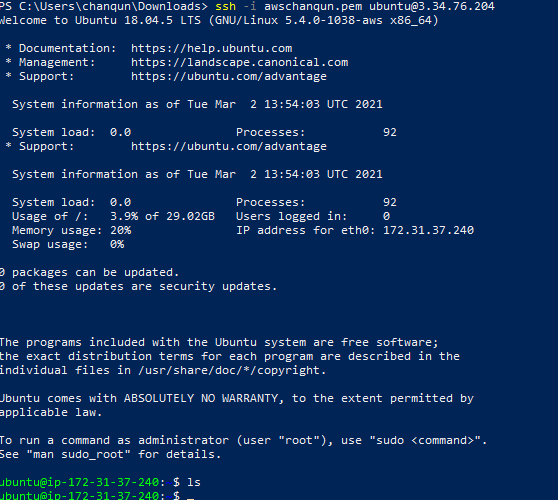

# 리눅스 서버 (EC2) 생성

### 클라우드 컴퓨팅 설정

1. EC2 또는 인스턴스(서버) 생성
2. Elastic IP (탄력적 IP) 생성
   - IP 주소 : 128.12.10.1
   - 보통은 동적으로 IP를 바꿔준다.
   - 서버는 고정 IP를 가져야 한다.

3. 자기 PC(클라이언트)에서 EC2(서버) 접속

나라마다 서버를 제공한다. (미국 같은 경우 외부로 개인 정보 반출이 법적으로 금지되어 있어 미국 서버를 이용해야한다.)

### 리눅스 배포판(패키지)

- 리눅스 커널 및 다양한 소프트웨어 패키지를 묶어서 배포하는 것 - 리눅스 배포판(패키지)
- 리눅스 배포판 예1
  - https://ko.wikipedia.org/wiki/%EB%A6%AC%EB%88%85%EC%8A%A4_%EB%B0%B0%ED%8F%AC%ED%8C%90

> 서버에 작업 접근은 SSH, TCP, 22로 가능하게 보안 설정해준다.

>  window는 powershell을 이용해서 로그인 할 수 있다.