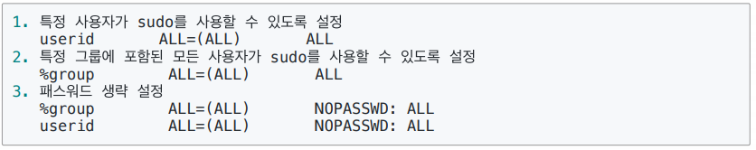
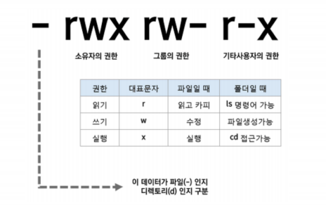

# 쉘로 시작하는 시스템 프로그래밍 기본

쉘 사용법 정리 - 다중 사용자 지원 관련 명령어


### 쉘 종류

- 쉘(shell) :  사용자와 컴퓨터 하드웨어 또는 운영체제간 인터페이스
  - 사용자의 명령을 해석해서, 커널에 명령을 요청해주는 역할
  - 관련된 시스템콜을 사용해서 프로그래밍이 작성되어 있다.

- Bourne-Again Shell (bash) : GNU 프로젝트의 일환으로 개발됨, 리눅스 거의 디폴트
- Bournes Shell (sh)
- C Shell (csh)
- Korn Shell (ksh) : 유닉스에서 가장 많이 사용됨


### 리눅스 기본 명령어 정리

- 리눅스 명령어는 결국 쉘이 제공하는 명령어
- 리눅스 기본 쉘이 bash 이므로, bash 에서 제공하는 기본 명령어를 배우는 것


### UNIX는 다중 사용자를 지원하는 시스템

- 다중 사용자 관련 명령어 알아보기


### whoami : 로그인한 사용자 ID를 알려줌

```bash
#whoami
root
```

### passwd : 로그인한 사용자 ID의 암호 변경

```bash
# passwd
Enter new UNIX password:
Retype new UNIX password:
passwd : password updated successfully
```

### useradd 와 adduser

- useradd는 사용자 기본 설정 자동으로 하지 않음
- adduser는 사용자 기본 설정을 자동으로 수행함

```bash
#adduser dave
Enter UNIX password:
Retype UNIX password:
```

### su :  사용자 변경

- 보통 su - 와 함께 사용
  - su root : 현재 사용자의 환경설정 기반, root로 변경
  - su - root : 변경되는 사용자의 환경설정을 기반으로, root로 전환

### sudo 명령어 : root 권한으로 실행하기

- root 계정으로 로그인 하지 않은 상태에서 root 권한이 필요한 명령을 실행할 수 있도록 하는 프로그램
- 기본 사용법
  - sudo 명령어
  - 사용 예
    - sudo apt-get update


```bash
# 숨김파일 까지 볼 수 있음 
.bashrc (숨김파일은 .으로 뜸)
ls -al 
```


- /etc/sudoers 설정 파일에서 다음과 같이 설정을 변경할 수 있음
  - visudo가 설치되어 있다면, 해당 명령을 통해 설정 파일이 오픈되어 바로 수정 가능

> cd s 누르고 tab누르면 s로 시작하는 파일이 보임



### cd : 디렉토리 이동

```bash
cd ~ #root로 이동
cd - #이전 폴더로 이동
```

```bash
man ls #manual을 볼 수 있음
```


### ls와 파일 권한

- 파일마다 소유자, 소유자 그룹, 모든 사용자에 대해
  - 읽고 쓰고 실행하는 권한 설정
  - 소유자 접근 권한 정보는 inode에 저장




### 파일 권한

- 사용자
  - 소유자 : 소유자에 대한 권한
  - 그룹 : 소유자가 속해 있는 그룹에 대한 권한
  - 공개 : 모든 사용자들에 대한 권한
- 퍼미션 종류, (권한 기호)
  - 읽기(r) : 읽기 권한
  - 쓰기(w) : 쓰기 권한
  - 실행(x) : 실행 권한


### chmod : 파일 권한 변경

- 기호 문자를 사용하는 방법


```bash
chmod g+rx test.c
chmod u+rw test.c
chmod ug+rw test.c
chmod u=rwx, g=rw, o=rx test.c
```

- 숫자를 사용하는 방법


```bash
chmod 400 mysecurity.pem
```

- 주로 사용하는 옵션
  - chmod -R 777 directory


### chown : 소유자 변경

- chown [옵션] [소유자:소유그룹]

```
chown root:root file
chown root: file
chown :root file
```


```bash
cat mysql.cnf # 파일내용 확인
head mysql.cnf # 앞 10줄
tail mysql.cnf # 뒷 10줄
more mysql.cnf # 화면이 넘어가기 전까지
```


### rm : 파일 및 폴더 삭제

- 주로 사용하는 명령어 형태 : rm -rf 디렉토리명
- r 옵션 : 하위 디렉터리를 포함한 모든 파일 삭제
- f 옵션 : 강제로 파일이나 디렉토리 삭제


### 정리

- 쉘 Bourne-Again Shell (bash) : GNU 프로젝트의 일환으로 개발, 리눅스 거의 디폴트
- user 관련 명령 : whoami, useradd, passwd, su - 명령
- Directory/file 관련 명령 : pwd,cd, ls, cat, headtail, more, rm
- Directory/file 권한 관련 명령 : chmod, chown, chgrp
- 관리자 권한으로 실행하기 : sudo
- 다양한 옵션은 man 명령으로 메뉴얼 확인이 가능