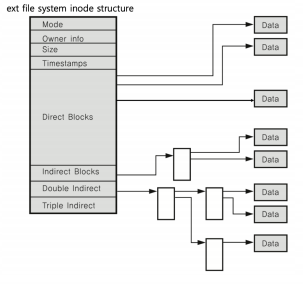
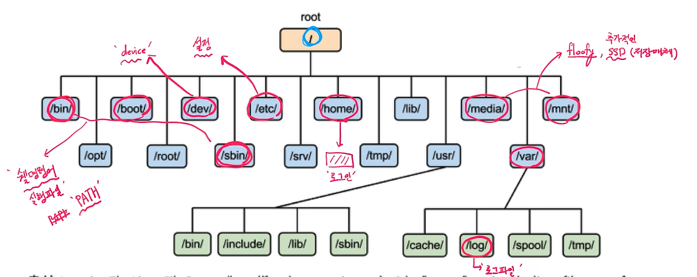

# 쉘로 시작하는 시스템 프로그래밍 기본 - 리눅스 파일 시스템과 관련 셀 명령어

### 리눅스와 파일 정리

- 모든 것은 파일이라는 철학을 따름
  - 모든 인터렉션은 파일을 읽고, 쓰는 것처럼 이루어져있음
  - 마우스, 키보드와 같은 모든 디바이스 관련된 기술도 파일과 같이 다루어짐
  - 모든 자원에 대한 추상화 인터페이스로 파일 인터페이스를 활용

### 가상 파일 시스템

- 파일 네임스페이스
  - A 드라이브 (A:/), C드라이브 (C:/windows) (X)
  - 전역 네임스페이스 사용
    - /media/floofy/chanqun.jpg
    - cat tty

### 리눅스 파일 시스템 (ext fild system)과 inode

- inode 기반 메타 데이터 (파일 권한, 소유자 정보, 파일 사이즈, 생성 기간, 데이터 저장 위치)

### 파일과 inode

- 리눅스 파일 탐색 : 예 - /home/ubuntu/link.txt

  1. 각 디렉토리 엔트리(dentry)를 탐색

     - 각 엔트리는 해당 디렉토리 파일/디렉토리 정보를 가지고 있음

  2. '/' dentry 에서 'home'을 찾고, 'home'에서 'ubuntu'를 찾고, 'ubuntu'에서 link.txt 파일이름에 해당하는 inode를 얻음

     >/home/ubuntu/link.txt

### 리눅스 파일 구조

