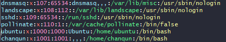

# 시스템 프로그래밍 기본

### 프로세스 ID

- 프로세스 ID
  - pid, 각 프로세스는 해당 시점에 unique한 pid를 가짐
  - pid 최대 값은 32768
  - 부호형(signed) 16비트 정수값 사용 2^15


```bash
sudo vi /proc/sys/kernel/pid_max
```

- 최근 할당된 pid가 200이라면, 그 이후는 201,202 식으로 할당


### 프로세스 계층 

- 최초 프로세스 : init 프로세스, pid 1
- init 프로세스는 운영체제가 생성
- 다른 프로세스는 또다른 프로세스로부터 생성
  - 부모 프로세스, 자식 프로세스
- ppid값이 부모 프로세스의 pid를 뜻함


### 실습

- ppid 값 확인해보기

```
ps -ef
-e 시스템상의 모든 프로세스에 대한 정보 출력
-f 다음 목록 출려(UID, PID, PPID, CPU%, STIME, TTY, TIME, CMD)
```


### 프로세스와 소유자(owner) 관리

- 리눅스 내부에서는 프로세스의 소유자(사용자)와 그룹을 UID/GID (정수)로 관리
- 사용자에 보여줄때에만 UID와 사용자이름 매핑 정보를 기반으로 사용자 이름으로 제공
- /etc/passwd 확인하기





### 프로세스 관리 관련 시스템콜

### getpid()와 getppid()

- 함수 원형

```c
#include <sys/types.h>
#include <unistd.h>

pid_t getpid(void);
pid_t getppid(void);
```

```c
#include <sys/types.h>
#include <unistd.h>
#include <stdio.h>

int main() {
	printf("pid=%d\n", getpid());
    printf("ppid=%d\n", getppid());
    
    return 0;
}
```

