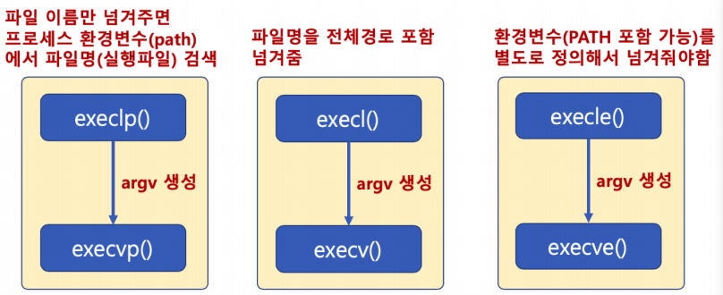
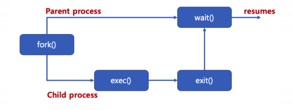
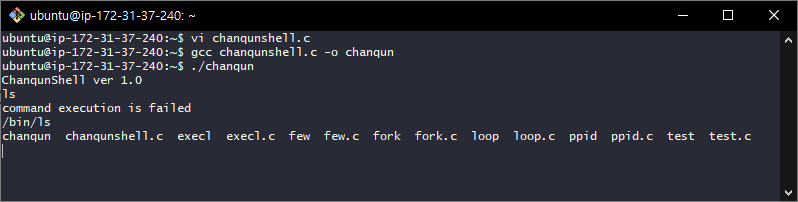

# 프로세스 생성과 종료


### 프로세스 생성

- 기본 프로세스 생성 과정
  1. TEXT, DATA, BSS, HEAP, STACK의 공간을 생성
  2. 프로세스 이미지를 해당 공간에 업로드하고, 실행 시작

- 프로세스 계층 : 다른 프로세스는 또다른 프로세스로부터 생성
  - 부모 프로세스, 자식 프로세스


### fork()와 exec() 시스템콜

- fork() 시스템콜
  - 새로운 프로세스 공간을 별도로 만들고, fork() 시스템콜을 호출한 프로세스(부모 프로세스) 공간을 모두 복사
    - 별도의 프로세스 공간을 만들고, 부모 프로세스 공간의 데이터를 그대로 복사
- exec() 시스템콜
  - exec() 시스템콜을 호출한 현재 프로세스 공간의 TEXT, DATA, BSS 영역을 새로운 프로세스의 이미지로 덮어씌움
    - 별도의 프로세스 공간을 만들지 않음


### fork() 시스템콜

>  fork있으면 코드는 같은데 프로세스가 두 개가 됨
> 0이면 자식 프로세스, 0보다 크면 부모 프로세스

```c
헤더 파일 : <unistd.h>
함수 원형 : pid_t fork(void);
```

```c
#include <sys/types.h>
#include <unistd.h>
#include <stdio.h>

int main() {
	pid_t pid;
	printf("Before fork() call\n");
	pid = fork();
	
	if (pid == 0) {
		printf("This is Child process. PID is %d\n", pid);
	} else if (pid > 0) {
	    printf("This is Parent process. PID is %d\n", pid);
	} else {
		printf("fork() is failed\n");
	}
}
```


### fork() 시스템콜 

- pid = fork()가 실행되면 부모 프로세스와 동일한 자식 프로세스가 별도 메모리 공간에 생성 
- 자식 프로세스는 pid가 0으로 리턴, 부모 프로세스는 실제 pid 리턴 
- 두 프로세스의 변수 및 PC(Program Count) 값은 동일 
- 새로운 프로세스 공간을 별도로 만들고, fork() 시스템콜을 호출한 프로세스(부모 프로세스) 공간을 모두 복사한 후, fork() 시스템콜 이후 코드부터 실행


### exec() 시스템콜 family

```c
헤더 파일: <unistd.h>
함수 원형:
int execl(const char *path, const char *arg, ...);

int execlp(const char *file, const char *arg, ...);
// 파일 이름을 해당 프로세스를 실행한 프로세스의 환경변수(path)를 검생

int execle(const char *path, const char *arg, ..., char * const envp[]);
// 환경 변수를 지정하고자 할 때
char *envp[] = {"USER=dave", "PATH=/bin", (char *)0};
// 인수 리스트를 내용으로 하는 문자열 배열

int execv(const char *path, char *const argv[]);
char *arg[] = {"ls","-al", NULL};
// 변수를 미리 설정해서 넣어줄 수 있음


int execvp(const char *file, char *const argv[]);

int execvpe(const char *file, char *const argv[], char *const envp[]);
```




### execl() 시스템콜 예

```c
#include <unistd.h>
#include <stdio.h>
#include <stdlib.h>
int main() {
	printf("execute ls\n");
	execl("/bin/ls", "ls", "-l", NULL);
	perror("execl is failed\n");
	exit(1);
}
```


### execl() 시스템콜 예 

- execl() 시스템콜을 실행시킨 프로세스 공간에 새로운 프로세스 이미지를 덮어씌우고, 새로운 프로세스 를 실행 
- perror() 함수가 호출된다는 의미는 새로운 프로세스 이미지로 덮어씌우는 작업이 실행되지 못했다는 의미 
  - 즉, execl() 시스템콜 실행 실패


### fork()와 exec()

- 리눅스 프로세스 실행
  1. 부모 프로세스로부터 새로운 프로세스 공간을 만들고 부모 프로세스 데이터 복사 (fork)
  2. 새로운 프로세스를 위한 바이너리를 새로운 프로세스 공간에 덮어씌움 (exec)


### wait() 시스템콜

- wait() 함수를 사용하면, fork()함수 호출시, 자식 프로세스가 종료할 때까지, 부모 프로세스가 기다림
- 자식 프로세스와 부모 프로세스의 동기화, 부모 프로세스가 자식 프로세스보다 먼저 죽는 경우를 막기 위해 사용 (고아 프로세스)




### fork(), execl(), wait() 시스템콜

```c
#include <unistd.h>
#include <stdio.h>
#include <stdlib.h>
#include <sys/wait.h>

int main() {
    int pid;
    int child_pid;
    int status;
	pid = fork();
    switch (pid) {
        case -1:
            perror("fork is failed\n");
            break;
    	case 0:
	        execl("/bin/ls", "ls", "-al", NULL);
	    	perror("execl is failed\n");
	    	break;
    	default:
		    child_pid = wait(NULL);
		    printf("ls is complete\n");
		    printf("Parent PID (%d), Child PID (%d)\n", getpid(),child_pid);
		    exit(0);
     }
}
```

- execl() 만 사용하면, 부모 프로세스가 사라짐 
- 이를 유지하기 위해, fork()로 새로운 프로세스 공간 복사 후, execl() 사용 
- wait() 함수를 사용해서 부모 프로세스가 자식 프로세스가 끝날 때까지 기다릴 수 있음

> 쉘 프로그램은 fork(), exec() 계열, wait() 함수를 기반으로 작성 가능


```c
#include <unistd.h>
#include <stdio.h>
#include <string.h>
#include <stdlib.h>
#include <sys/wait.h>
#include <sys/types.h>
#define MAXLINE 64

int main(int argc, char **argv) {
	char buf[MAXLINE];
	pid_t pid;
	printf("ChanqunShell ver 1.0\n");
	
	while(1) {
		memset(buf, 0x00, MAXLINE);
		fgets(buf, MAXLINE - 1, stdin);
		
		if(strncmp(buf, "exit\n", 5) == 0){
			break;
		}
		
		buf[strlen(buf) - 1] = 0x00;
		
		pid = fork();
		if(pid==0){
			if(execl(buf, buf, NULL) == -1){
				printf("command execution is failed\n");
				exit(0);
			}
		}
		if(pid>0){
			wait(NULL);
		}
	}
	
	return 0;
}

```



> 이렇게 쉘 프로그램도 만들 수 있다.