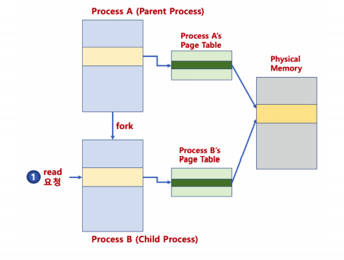
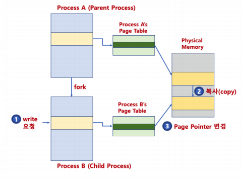

#  프로세스 관리 - 프로세스 생성 (copy on write)


### copy-on-write

- fork()는 새로운 프로세스 공간 생성 후, 기존 프로세스 공간 복사

> 4GB를 복사한다면, 프로세스 생성 시간이 오래 걸림


- 자식 프로세스 생성시, 부모 프로세스 페이지를 우선 사용
- 부모 또는 자식 프로세스가 해당 페이지를 읽기가 아닌, 쓰기를 할 때
  - 이 때 페이지를 복사하고, 분리함
- 장점
  - 프로세스 생성 시간을 줄일 수 있음
  - 새로 생성된 프로세스에 새롭게 할당되어야 하는 페이지 수도 최소화


### copy-on-write (read 시)

- 자식 프로세스 생성시, 부모 프로세스 페이지를 우선 사용



- 부모 또는 자식 프로세스가 해당 페이지를 읽기가 아닌, 쓰기 처음 요청시, 페이지 복사 및 분리




### 프로세스 종료

- exit() 시스템콜 : 프로세스 종료

```c
#include <stdlib.h>
void exit(int status);
//status 정보는 프로세스 종료 상태 번호 > 0은 정상 종료
```

- main 함수의 return 0; 와 exit(0); 의 차이는?
  - exit() 함수 : 즉시 프로세스를 종료함 (exit() 함수 다음에 있는 코드는 실행되지 않음)
  - return 0 : 단지 main()이라는 함수를 종료함
    - 단 main()에서 return 시, C 언어 실행 파일에 기본으로 포함된 _start()함수를 호출하게 되고, 해당 함수는 결국 exit()함수를 호출함

> main() 함수에서 return 0;은 exit() 호출과 큰 차이가 없음


### exit() 시스템콜

- 부모 프로세스는 status & 0377계산 값으로 프로세스 종료 상태 확인 가능

```c
#include <stdlib.h>
void exit(int status);
```

- 기본 사용 예

```
exit(EXIT_SUCCESS); 0
exit(EXIT_FAILURE); 1
```

- exit() 시스템콜 주요 동작
  - atexit()에 등록된 함수 실행
  - 열려 있는 모든 입출력 스트림 버퍼 삭제
  - 프로세스가 오픈한 파일을 모두 닫음
  - tmpfile()함수를 통해 생성한 임시 파일 삭제
    - 참고 : tmpfile() - 임시 파일을 wb+ (쓸 수 있는 이진파일 형태) 모드로 오픈가능

```c
#include <stdio.h>
FILE *tmpfile(void);
```


### atexit() 함수

- 프로세스 종료시 실행될 함수를 등록하기 위해 사용
- 등록된 함수를 등록된 역순서대로 실행

```c
#include <stdlib.h>
#include <stdio.h>

int main(void) {
	void exithandling(void);
    void goodbyemessage(void);
    int ret;
    
    ret = atexit(exithandling);
    if(ret != 0) perror("Error in atexit\n");
    ret = atexit(goodbyemessage);
    if(ret != 0) perror("Error in atexit\n");
    exit(EXIT_SUCCESS);
}

void exithandling(void){
	printf("exit handling\n");
}

void goodbyemessage(void){
	printf("goodbyemessasage\n");
}
```


### wait() 시스템콜

- wait() 함수를 사용하면, fork()함수 호출시, 자식 프로세스가 종료할 때까지, 부모 프로세스가 기다림
- 자식 프로세스가 종료되면, 좀비 프로세스가 되어, 해당 프로세스 조사를 위한 최소 정보만 가지고 있는 상태가 됨
- 완전히 끝나면, 해당 정보도 삭제되고, 부모 프로세스에 SIGCHLID 시그널이 보내짐

- wait() 리턴값
  - 에러가 발생한 경우

```
#include <sys/wait.h?
pid_t wait (int *status)
//리턴값은 종료된 자식 프로세스의 pid
```

- status 정보를 통해 기본적인 자식 프로세스 관련 정보를 확인할 수 있음

```
int WIFEXITED(status); //자식 프로세스가 정상 종료시 리턴값은 0이 아닌 값이 됨
```


