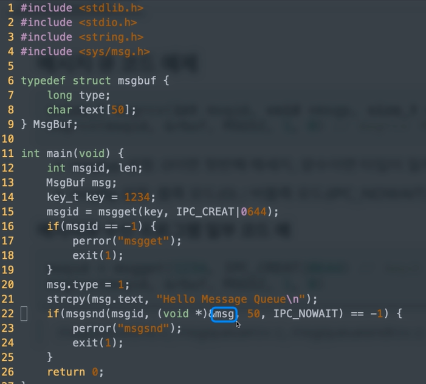
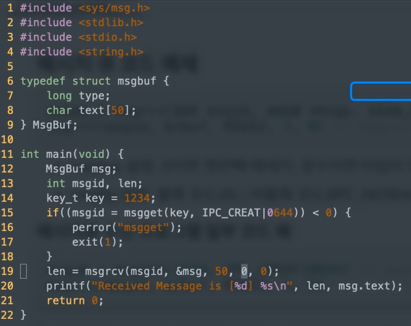

### 프로세스간 커뮤니케이션 - 각 IPC 기법관련 시스템콜 사용법 이해

### 다양한 IPC 기법 

- IPC: InterProcess Communcation 

  1. file 사용 
  2. Message Queue 
  3. Shared Memory 

  4. Pipe 

  5. Signal 

  6. Semaphore 

  7. Socket

     ...


### 파이프

- pipe (파이프)
  - 기본 파이프는 단방향 통신
  - fork()로 자식 프로세스 만들었을 때, 부모와 자식간의 통신


```c
#include <stdio.h>
#include <stdlib.h>
#include <unistd.h>
#define MSGSIZE 255

char* msg = "Hello Child Process!";
int main()
{
    char buf[255];
    int fd[2], pid, nbytes;
    if (pipe(fd) < 0) // pipe(fd) 로 파이프 생성
	    exit(1);
    
    pid = fork(); // 이 함수 실행 다음 코드부터 부모/자식 프로세스로 나뉘어짐
    if (pid > 0) { // 부모 프로세스에는 자식 프로세스 pid값이 들어감
    	write(fd[1], msg, MSGSIZE); //fd[1]에 씁니다.
    	exit(0);
	}
	else { // 자식 프로세스에는 pid값이 0이 됨
        nbytes = read(fd[0], buf, MSGSIZE); // fd[0]으로 읽음
        printf("%d %s\n", nbytes, buf);
        exit(0);
	}
	return 0;
}
```


### 메시지 큐(message queue)

- FIFO 정책으로 데이터 전송

```c
msqid = msgget(key, msgflg)//key는 1234, msgflg는 옵션
```

- msgflg설정
  - IPC_CREAT : 새로운 키면 식별자를 새로 생성, IPC_CREAT|접근권한
  - 예 : IPC_CREAT|0644 ->rw-r--r--

```c
msgsnd(msqid, &sbuf, buf_length, IPC_NOWAIT)
```

### 메시지큐 전송

```
msqid = msgget(1234, IPC_CREAT|0644) // key는 1234, msgflg는 옵션
msgsnd(msqid, &sbuf, buf_length, IPC_NOWAIT)
```

```c
ssize_t msgrcv(int msqid, void *msgp, size_t msgsz, long msgtyp, int msgflg)
msgrcv(msqid, &rbuf, MSGSZ, 1, 0) // msgrcv 예
```

- msgtyp 설정 : 0이면 첫번째 메시지, 양수이면 타입이 일치하는 첫번째 메시지

- msgflg 설정 : 블록보드 0 / 비블록 모드(IPC_NOWAIT)

### 메시지큐 수신

```c
msqid = msgget(1234, IPC_CREAT|0644) // key는 동일하게 1234로 해야 해당 큐의 msgid를 얻을 수 있음
msgrcv(msqid, &rbuf, MSGSZ, 1, 0)
```






### 참고 : ftok()

- ftok() : 키 생성을 위한 함수
  - pah 경로명의 inode값과 숫자값(id)를 기반으로 키 생성
  - 경로 삭제 후 재생성시 inode값이 달라지므로, 이전과는 다른 키값이 리턴

```
#include <sys/ipc.h>

key_t ftok(const char *path, int id);

//예
key = ftok("keyfile", 1);
id = msgget(key, IPC_CREAT|0640);
```

