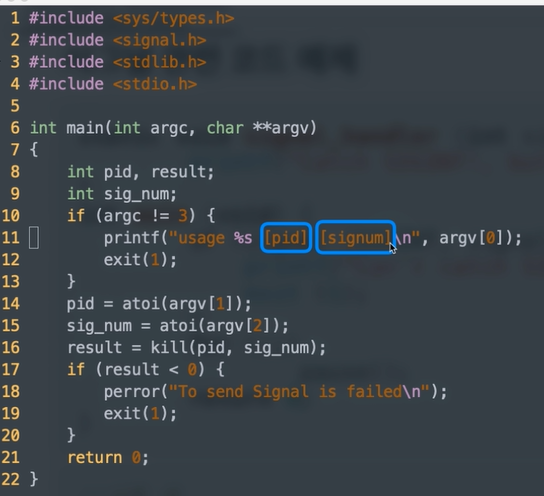
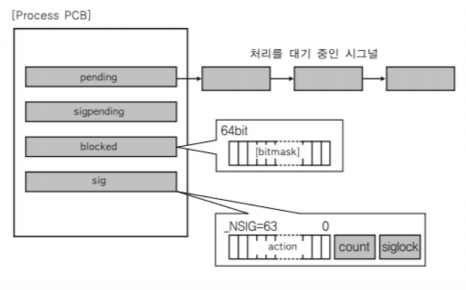

# 시그널 동작 메커니즘 - 사용법 이해


### 시그널 (signal)

- 유닉스에서 30년 이상 사용된 전통적인 기법
- 커널 또는 프로세스에서 다른 프로세스에 어떤 이벤트가 발생되었는지를 알려주는 기법

> Ctrl + C를 눌러서 프로세스 종료시키기 (시그널 사용 예)

-> 디폴트 -> OS -> 프로세스 디폴트 종료


### 주요 시그널

- 시그널 종류와 각 시그널에 따른 기본 동작이 미리 정해져 있음
  - SIGKILL : 프로세스를 죽여라(슈퍼관리자가 사용하는 시그널로, 프로세스는 어떤 경우든 죽도록 되어 있음)
  - SIGALARM: 알람을 발생한다 
  - SIGSTP: 프로세스를 멈춰라(Ctrl + z) 
  - SIGCONT: 멈춰진 프로세스를 실행해라 
  - SIGINT: 프로세스에 인터럽트를 보내서 프로세스를 죽여라(Ctrl + c) 
  - SIGSEGV: 프로세스가 다른 메모리영역을 침범했다.

> 문자에 대응하는 숫자가 있음
>
> 시그널 종류 : kill -l


### 시그널 (signal) 동작

- 프로그램에서 특정 시그널의 기본 동작 대신 다른 동작을 하도록 구현 가능
- 각 프로세스에서 시그널 처리에 대해 다음과 같은 동작 설정 가능
  1. 시그널 무시
  2. 시그널 블록(블록을 푸는 순간, 해당 프로세스에서 시그널 처리)
  3. 프로그램 안에 등록된 시그널 핸들러로 재정의한 특정 동작 수행
  4. 등록된 시그널 핸들러가 없다면, 커널에서 기본 동작 수행


### 시그널 보내기

```c
#include <sys/types.h>
#include <signal.h>
// pid : 프로세스의 PID
// sig : 시그널 번호
int kill(pid_t pid, int sig);

#include <signal.h>
void (*signal(int signum, void (*handler)(int)))(int);
// 예1
// void (*handler)(int): SIG_IGN - 시그널 무시, SIG_DFL - 디폴트 동작
signal(SIGINT, SIG_IGN);
// 예2
// SIGINT 시그널 수신 시, signal_handler 함수를 호출
signal(SIGINT, (void *)signal_handler);
```


sigloop.c

```c
static void signal_handler (int signo) {
	printf("Catch SIGINT!, but no stop\n");
}
int main (void) {
	if (signal (SIGINT, signal_handler) == SIG_ERR) {
		printf("Can't catch SIGINT!\n");
		exit (1);
	}
	for (;;)
		pause();
	return 0;
}

```

sigkill.c




### 시그널과 프로세스

- PCB에 해당 프로세스가 블록 또는 처리해야하는 시그널 관련 정보 관리
- 커널 모드에서 사용자 모드 전환시 시그널 정보 확인해서, 해당 처리



