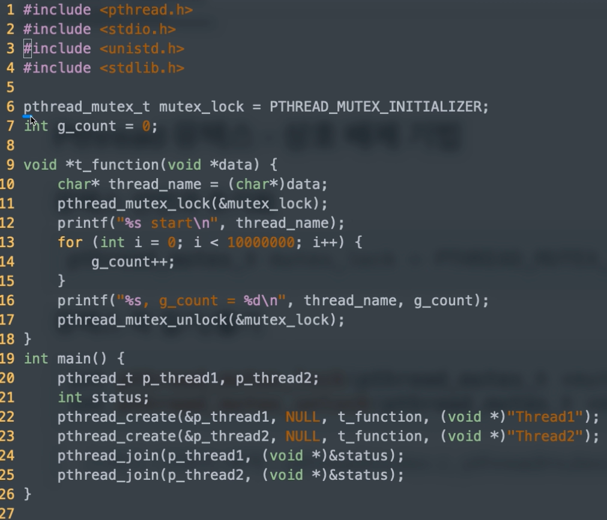

# 스레드 - Pthread


### Pthread 란?

- thread 표준 API

  - POSIX 스레드 또는 Pthread라고 부름

- Pthread API

  - 저수준 API로 100여개의 함수 제공
  - 복잡하지만 유닉스 시스템 핵심 스레딩 라이브러리

  - 다른 스레딩 솔루션도 결국 Pthread를 기반으로 구현되어 있으므로, 익혀둘 가치가 있음


### Pthread 라이브러리

- <pthread.h>헤더 파일에 정의
- 모든 함수는 pthread_로 시작
- 크게 두 가지 그룹
  - 스레드 관리 : 생성, 종료, 조인, 디태치 함수 등
  - 동기화 : 뮤텍스등 동기화 관련 함수

- 기본 라이브러리(glibc)와 분리된 libpthread라이브러리에 pthreaed 구현되어 있으므로 컴파일시 명시적으로 -pthread 옵션 필요

```sh
gcc -pthread test.c -o test
```


### 스레드 생성

```c++
// thread: 생성된 스레드 식별자
// attr: 스레드 특정 설정(기본 NULL)
// start_routine: 스레드 함수(스레드로 분기해서 실행할 함수)
// arg: 스레드 함수 인자
int pthread_create(pthread_t *thread, const pthread_attr_t *attr,
void *(*start_routine)(void *), void *arg);
```

- 예

```c
pthread_t thread1;
void *thread_function(void *ptr);
ret = pthread_create(&thread1, NULL, thread_function, (void*)message1);
```


### 스레드 종료

```c
// exit와 유사, NULL 또는 0은 정상 종료
void pthread_exit(void *retval);

pthread_exit(NULL);
```


### 스레드 조인

- 스레드 종료 상태 값을 가지고 메인에서 다른 처리를 한다.

```c
// thread: 기다릴 스레드 식별자
// thread_return: 스레드의 리턴 값을 가져올 수 있는 포인터
int pthread_join(pthread_t thread, void **thread_return);
```


> join은 다음이 대기 상태가 되고 detach는 바로 시작된다.

### 스레드 디태치

- 해당 스레드가 종료될 경우, 즉시 관련 리소스를 해제(free)
  - pthread_join를 기다리지 않고, 종료 즉시 리소스를 해제

```c
// thread: detach할 스레드 식별자
int pthread_detach(pthread_t thread);
```


### Pthread 뮤텍스 - 상호 배제 기법

- 뮤텍스 선언과 초기화

```c
pthread_mutex_t mutex_lock = PTHREAD_MUTEX_INITIALIZER;
```

- 뮤텍스 락 걸기/풀기

```c
int pthread_mutex_lock(pthread_mutex_t *mutex);
int pthread_mutex_unlock(pthread_mutex_t *mutex);
```



