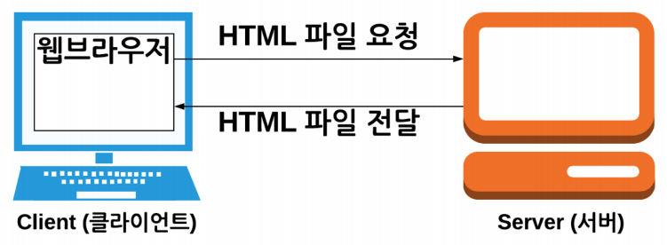
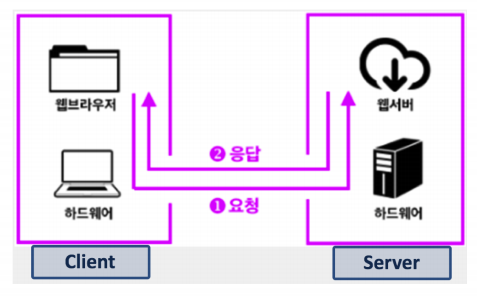
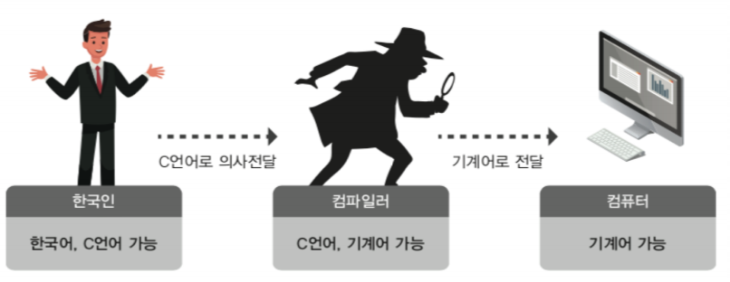

# 한 번은 알아둬야 할 리눅스 배경, 역사, 철학

### 리눅스(LINUX)

- 서버에 많이 사용되는 운영체제

- 최근 서버 환경은 주로 리눅스

- 프로그래밍을 할 때에도 많이 사용이 된다.

- 클라우드 컴퓨팅에서도 많이 사용됨
- 운영체제, 소프트웨어의 대부 UNIX 계열 운영체제
  - 완전 프로그래머 스타일 인터페이스
- plain 하게 프로그래밍이 가능
  - ANSI C - C 언어 표준

### 정리

- 리눅스 장점
  - 서버 + 클라우드 컴퓨팅
  - 프로그래밍에도 유용
  - UNIX 계열 운영체제이므로, 사용법을 익힐 수 있다.