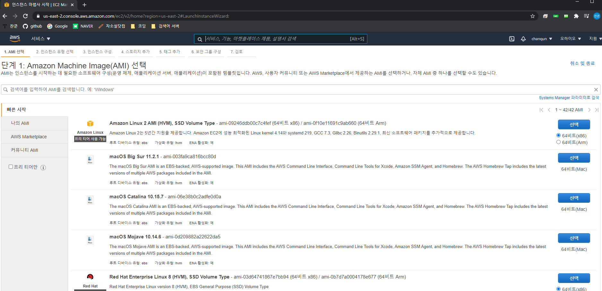

# 리눅스 설치

- 클라우드 컴퓨팅 (AWS) 기반 리눅스 설치

### 가볍게 이해하는 클라우드 컴퓨팅

- 리눅스 설치 방법

  1. 가상 머신 소프트웨어
     - PC 환경에 따라서, 예상치 못한 문제

  2. 클라우드 컴퓨팅 서비스 활용
     - 최신 기술에 익숙해진다는 장점
     - 동일한 환경에서 사용이 가능

### 정리

- 클라우드 컴퓨팅 (AWS)과 장점

- 회원가입

