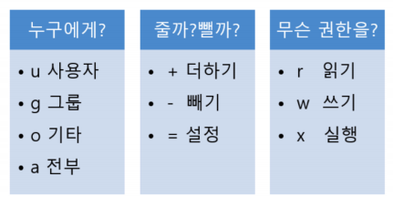
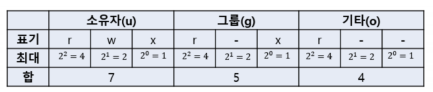

#  쉘로 시작하는 기본 프로그래밍 기본 - 리다이렉션과 파이프


### chmod : 파일 권한 변경

- 기호 문자를 사용하는 방법




```bash
chmod g+rx test.c
chmod u+rw test.c
chmod ug+rw test.c
chmod u=rwx, g=rw, o=rx test.c
```

- 숫자를 사용하는 방법



```bash
chmod 400 mysecurity.pem
```

- 주로 사용하는 옵션
  - chmod -R 777 directory


### chown : 소유자 변경

- chown [옵션] [소유자:소유그룹]

```
chown root:root file
chown root: file
chown :root file
```


```bash
cat mysql.cnf # 파일내용 확인
head mysql.cnf # 앞 10줄
tail mysql.cnf # 뒷 10줄
more mysql.cnf # 화면이 넘어가기 전까지
```


### rm : 파일 및 폴더 삭제

- 주로 사용하는 명령어 형태 : rm -rf 디렉토리명
- r 옵션 : 하위 디렉터리를 포함한 모든 파일 삭제
- f 옵션 : 강제로 파일이나 디렉토리 삭제


### 정리

- 쉘 Bourne-Again Shell (bash) : GNU 프로젝트의 일환으로 개발, 리눅스 거의 디폴트
- user 관련 명령 : whoami, useradd, passwd, su - 명령
- Directory/file 관련 명령 : pwd,cd, ls, cat, headtail, more, rm
- Directory/file 권한 관련 명령 : chmod, chown, chgrp
- 관리자 권한으로 실행하기 : sudo
- 다양한 옵션은 man 명령으로 메뉴얼 확인이 가능