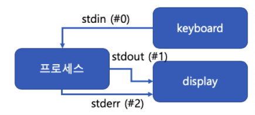
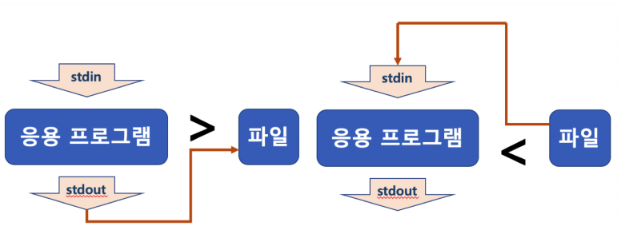

#  쉘로 시작하는 기본 프로그래밍 기본 - 리다이렉션과 파이프


### Standard Stream(표준 입출력)

- command로 실행되는 프로세스는 세 가지 스트림을 가지고 있음
  - 표준 입력 스트림 (Standard Input Stream) - stdin
  - 표준 출력 스트림 (Standard Output Stream) - stdout
  - 오류 출력 스트림 (Standare Error Stream) - stderr

- 모든 스트림은 일반적인 plain text로 console에 출력하도록 되어 있음




### 리다이렉션 (redirection)

- 표준 스트림 흐름을 바꿔줄 수 있다.
  - <, > 을 사용함
  - 주로 명령어 출력을 화면이 아닌 파일에 쓸 때



- 예

  1. ls > files.txt

     - ls로 출력되는 표준 출력 스트림의 방향을 files.txt로 바꿔줌

       file에 저장 됨

  2. head < files.txt

     - files.txt의 파일 내용이 head라는 파일의 처음부터 10라인까지 출력해주는 명령으로 넣어짐

  3. head < files.txt > files2.txt

     - files.txt의 파일 내용이 head로 들어가서, files.txt 10줄 출력

     - head의 출력 스트림은 다시 files2.txt로 들어감

     - head는 files.txt 내용을 출력하지 않고, 해당 출력 내용이 다시 files2.txt에 저장

       (결과적으로 files.txt 10줄이 files2.txt로 감)

  4. 기존 파일에 추가는 >> 또는 << 사용
     - ls >> files.txt
     - 기존에 있는 files.txt 파일 끝에,  ls 출력 결과를 추가


### 파이프(pipe) 예

- 두 프로세스 사이에서 한 프로세스의 출력 스트림을 또다른 프로세스의 입력 스트림으로 사용할 때 사용 됨


1. ls | grep file
   - ls 명령을 통한 출력 내용이 grep 명령의 입력 스트립으로 들어감
   - grep file는 grep 명령의 입력 스트림을 검색해서 file이라는 문구가 들어 있는 입력 내용만 출력해줌
   - 따라서, ls 명령으로 해당 디렉토리 또는 파일명에 file이라는 문구가 있는지 출력해줌

### 참고 : grep 명령어

grep : 검색 명령

``` 
grep [-option] [pattern] [file or directory name]
<option>
-i : 영문의 대소문자를 구별하지 않음
-v : pattern을 포함하지 않는 라인을 출력
-n : 검색 결과의 각 행의 선두에 행 번호를 넣는다.
-l : 파일명만 출력
-c : 패텅과 일치하는 라인의 개수만 출력
-r : 하위 디렉토리까지 검색
```


- 사용 예

```
grep python files.txt -> files.txt에서 python문구가 들어간 모든 행 출력
grep -r python foldername -> foldername라는 폴더내의 하위 폴더를 포함한 모든 파일 중 python문구가 들어간 행 출력
grep -E "go|java|python" filex.txt -> 셋 중 하나라도 있는 행을 출력
```

