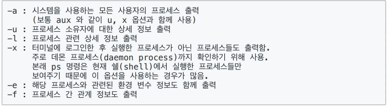

# 쉘로 시작하는 시스템 프로그래밍 기본 - 리눅스 프로세스


### 프로세스 vs 바이너리

- 코드 이미지 또는 바이너리 : 실행파일
- 실행 중인 프로그램 : 프로세스
  - 가상 메모리 및 물리 메모리 정보
  - 시스템 리소스 관련 정보
  - 스케줄링 단위


### 리눅스는 다양한 프로세스 실행 환경

- 리눅스는 기본적으로 다양한 프로세스가 실행됨
  - 유닉스 철학 : 여러 프로그램이 서로 유기적으로 각자의 일을 수행하면서 전체 시스템이 동작하도록 하는 모델


###  foreground process / background process

- foreground process : 쉘 (shell)에서 해당 프로세스 실행을 명령한 후, 해당 프로세스 수행 종료까지 사용자가 다른 입력을 하지 못하는 프로세스
- background process : 사용자 입력과 상관없이 실행되는 프로세스
  - 쉘(shell)에서 해당 프로세스 실행시, 맨 뒤에 &를 붙여줌
  - 사용 예 :

```
find / -name '*.py' > list.txt &
```


> gcc
>
> GNU에서 진행한 c linux compiler 


```bash
vi loop.c
gcc loop.c -o loop
./loop # path 설정을 하면 loop만으로 실행 가능하긴 함
```


### foreground process 제어하기

- [CTRL] + z : foreground 프로세스를 실행 중지 상태(suspend 모드)로 변경
- 맨 마지막 [CTRL] + z로 중지된 프로세스는 bg 명령으로 background 프로세스로 실행될 수 있음
- jobs 명령어 : 백그라운드로 진행 도는 중지된 상태로 있는 프로세스를 보여줌

- bg 가장 최근에 실행된 프로세스가 백그라운드 실행
  bg 2 : 중지된 2번을 실행


- [CTRL] + c : 프로세스 작업 취소 (해당 프로세스는 완전히 종료)

> 운영체제 소프트웨어 인터럽트가 해당 프로세스에 보내짐 - 그래서 프로세스 제어가 가능함


### 프로세스 상태 확인 -ps 명령어

- 사용법 : ps [option(s)]
- option(s)




- 데몬 프로세스 (daemon process) : daemon은 악마를 의미함. 사용자 모르게 시스템 관리를 위해 실행되는 프로세스로 보통 시스템이 부팅될 때 자동 실행 

- 주요 ps 출력 정보 항목


### 프로세스 중지시키기

- kill 명령어
  - 사용법
    1. kill % 작업 번호 (job number)
    2. kill 프로세스 ID(pid)
    3. 작업 강제 종료 옵션 -9

```bash
kill -9 30452
```


