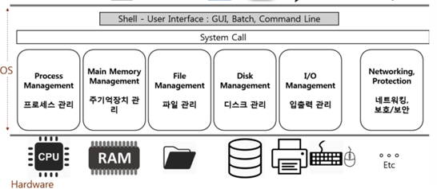

### 운영체제 역할1: 시스템 자원(System Resource) 관리자

> -    Operating System 또는 OS 라고 부른다.
> -    시스템 자원 = 컴퓨터 하드웨어

CPU, Memory, I/O Devices (Monitor, Mouse, Keyboard, Network)

**운영체제 역할**

1. 컴퓨터 하드웨어는 스스로 할 수 있는 것이 없다. 

>+ CPU: 각 프로그램이 얼마나 CPU를 사용할지를 결정할 수는 없다.
>+ Memory: 각 프로그램이 어느 주소에 저장되어야 하는지, 어느 정도의 메모리 공간을 확보해줘야 하는지 결정할 수는 없다. 
>+ 저장매체(HDD, SSD): 어떻게, 어디에 저장할지는 결정할 수 없다. 
>+ 키보드/마우스: 스스로 표시할 수는 없음 그래서 운영체제가 필요하다

2. 사용자와 컴퓨터간의 커뮤니케이션 지원

3. 컴퓨터 하드웨어와 프로그램을 제어
                       

</img>

**대표적인 운영체제**

* Windows OS, Mac OS, UNIX
* UNIX OS
* LINUX OS

 