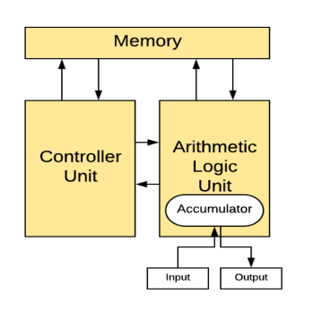

### 운영체제와 응용 프로그램

#### 응용 프로그램이란?

>    프로그램 = 소프트웨어   
>    소프트웨어 = 운영체제, 응용프로그램 (엑셀, 파워포인트 …)   
>    응용 프로그램 = Application = App

 

**운영체제와 응용 프로그램간의 관계**

운영체제는 응용 프로그램을 관리

  + 응용 프로그램 간의 **권한**을 관리

관리자 권한으로 실행

  + 응용 프로그램을 사용하는 **사용자**도 관리

로그인

 

**응용 프로그램은 누구나 만들 수 있다.**

> - 응용 프로그램에 무한 반복문을 넣었다.
> -    응용 프로그램을 잘 못 작성해서, 프로그램이 다운
> -    모든 파일 삭제 막기 (권한/사용자 관리)
> -    응용 프로그램이 욕심이 많아서, CPU를 자기만 쓴다. ß 운영체제가 막는다.

**따라서 운영체제는 응용 프로그램을 관리**

> 1.   응용 프로그램을 관리
> 2.   시스템 자원을 관리
> 3.   사용자와 컴퓨터 간 커뮤니케이션을 지원

운영체제의 목표 : 사용자가 사용하는 응용 프로그램이 효율적으로, 적절하게 동작하도록 지원

운영체제는 응용 프로그램이 요청하는 시스템 리소스를 효율적으로 분배하고, 지원하는 소프트웨어

쉬어가기: 운영체제는 어디에 있을까?

운영체제는 저장매체 SSD/HDD에 설치

 

#### 컴퓨터 구조 복습

컴퓨터를 키면?  - > 운영체제는 Memory에 올라간다.

참고 : 폰노이만 구조

 

#### 정리

> 1.   운영체제의 역할 시스템 자원, 응용 프로그램 관리, 효율적 분배
> 2.   응용 프로그램이란? – 소프트웨어(운영체제, 응용 프로그램)

 