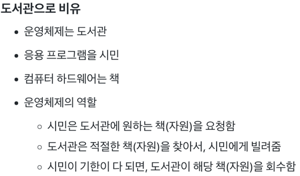
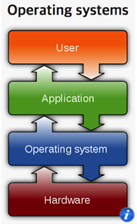

### 운영체제 구조 – 시스템 콜

 

**응용 프로그램, 운영체제, 컴퓨터 하드웨어 (시스템 리소스) 관계**

 

**응용 프로그램, 운영체제, 컴퓨터 하드웨어 관계**

> - 운영체제는 응용 프로그램이 요청하는 메모리를 허가, 분배
> - 운영체제는 응용 프로그램이 요청하는 CPU제공
> -    운영체제는 응용 프로그램이 요청하는 IO Devices 사용을 허가/제어

사용자, 응용 프로그램, 운영체제, 컴퓨터 하드웨어와 관계

**운영체제는 사용자 인터페이스 제공**

쉘(Shell)

> 사용자가 운영체제 기능과 서비스를 조작할 수 있도록 인터페이스를 제공하는 프로그램
> 쉘은 CLI, GUI 환경 두 종류로 분류

 

**운영체제는 응용 프로그램을 위해서도 인터페이스를 제공**

\-    API (Application Programming Interface)

함수로 제공

open()

\-    보통은 라이브러리(library) 형태로 제공

 

**시스템 콜**

> \-    시스템 콜 또는 시스템 호출 인터페이스
> \-    운영체제가 운영체제 각 기능을 사용할 수 있도록 시스템 콜이라는 명령 또는 함수를 제공
> \-    API 내부에는 시스템콜을 호출하는 형태로 만들어지는 경우가 대부분

 

**운영체제를 만든다면?**

> 1.   운영체제를 개발한다. (kernel)
> 2.   시스템 콜을 개발
> 3.   C API 개발 – JAVA, python
> 4.   Shell 프로그램 개발
> 5.   응용 프로그램 개발

 

**운영체제와 시스템콜**

\-    시스템콜 정의 예

POSIX API, 윈도우 API

API: 각 언어별 운영체제 기능 호출 인터페이스 함수

시스템콜: 운영체제 기능을 호출하는 함수

 

**정리**

> \-    운영체제는 컴퓨터 하드웨어와 응용 프로그램을 관리한다.
> \-    사용자 인터페이스를 제공하기 위해 쉘 프로그램을 제공한다
> \-    응용 프로그램이 운영체제 기능을 요청하기 위해서, 운영체제는 시스템 콜을 제공한다.

보통 시스템 콜을 직접 사용하기 보다는, 해당 시스템 콜을 사용해서 만든 각 언어별 
라이브러리(API)를 사용한다.

 