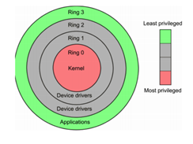
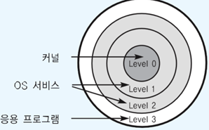
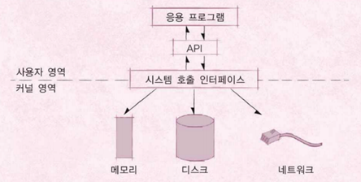
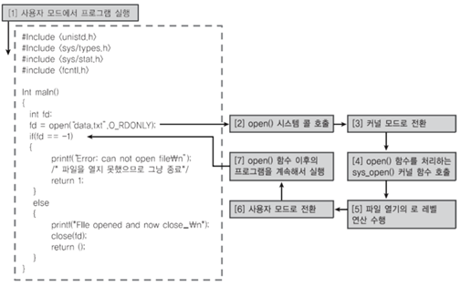

### 운영체제 구조 – 사용자와 커널 모드

 

**CPU Protection Rings**

\-    CPU도 권한 모드라는 것을 가지고 있다.

사용자 모드, 

커널모드 : 특권 명령어 실행과 원하는 작업 수행을 위한 자원 접근을 가능케 하는 모드

\-    

Kernel이란? 알맹이, 핵심

shell이란? 껍데기

 

사용자 모드 : 응용 프로그램이 사용

커널 모드 : OS가 사용

 

**응용 프로그램과 운영체제**

우리가 만드는 프로그램은 맨위에서 놀고 있다.

 

**시스템콜은 커널 모드로 실행**

> -    커널 모드에서만 실행 가능한 기능들이 있다
> -    커널 모드로 실행하려면, 반드시 시스템 콜을 거쳐야한다.
> -    시스템 콜은 운영체제 제공

**사용자 모드와 커널 모드**

> -    함부로 응용 프로그램이 전체 컴퓨터 시스템을 헤치지 못함
> -    주민등록등본은 꼭 동사무소 또는 민원24시에서 특별한 신청서를 써야만 발급

 

응용 프로그래머는 -> 사용자 프로그램
시스템 프로그래머 -> 운영체제 및 시스템 프로그램, 하드웨어

 

**정리**

> - 운영체제는 시스템 콜 제공
> - 프로그래밍 언어별로 운영체제 기능을 활용하기 위해, 시스템 콜을 기반으로 API제공
> - 응용 프로그램은 운영체제 기능 필요시, 해당 API를 사용해서 프로그램을 작성
> - 응용 프로그램이 실행되서, 운영체제 기능이 필요한 API를 호출하면, 시스템 콜이 호출되서, 커널 모드로 변경되어 OS내부에서 해당 명령이 실행되고, 다시 응용 프로그램으로 돌아간다.