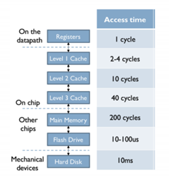
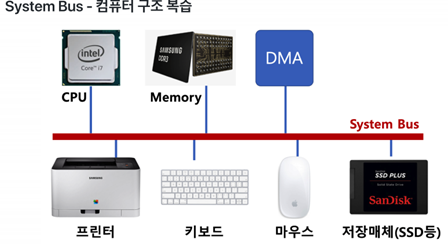

### 프로세스 스케줄링 – 멀티 프로그래밍

 

**멀티 프로그래밍**

> -    최대한 CPU를 많이 활용하도록 하는 시스템
>    시간 대비 CPU활용도를 높이기 위해
>    응용 프로그램을 짧은 시간 안에 실행 완료를 시킬 수 있음
>
> -    응용 프로그램은 온전히 CPI를 쓰기 보다, 다른 작업을 중간에 필요로 하는 경우가 많다.
>   응용 프로그램이 실행되다가 파일을 읽는다.
>   응용 프로그램이 실행되다가 프린팅 한다.

 

**메모리 계층 – 컴퓨터 구조 복습**

