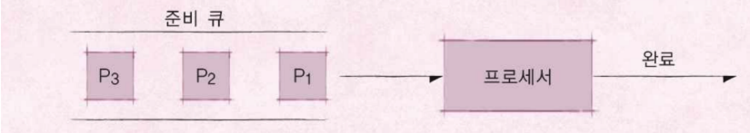
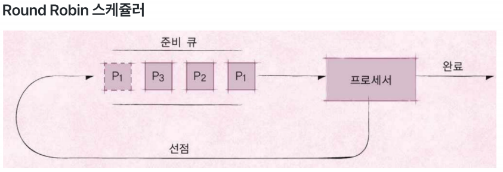

스케줄링 알고리즘
==============

### 프로세스 (Process) 란?

- 실행 중인 프로그램은 프로세스라고 함
	- 프로세스: 메모리에 올려져서, 실행 중인 프로그램
	- 코드 이미지(바이너리): 실행 파일, 예 ELF format

>프로세스라는 용어즌 작업, task, job 이라는 용어와 혼용

- 응용 프로그램 != 프로세스
	- 응용 프로그램은 여러 개의 프로세스로 이루어질 수 있음
- 하나의 응용 프로그램은 여러 개의 프로세스가 상호작용을 하면서 실행 될 수 있음

> 여러 프로그램을 만들어서, 서로 통신하면서 프로그램을 작성할 수 있음 (IPC 기법)

### 스케줄링 알고리즘

> 어느 순서대로 프로세스를 실행시킬까?

- 목표
	- 시분할 시스템 예 : 프로세스 응답 시간을 가능한 짧게
	- 멀티 프로그래밍 예 : CPU 활용도를 최대로 높혀서, 프로세스를 빨리 실행

### FIFO 스케줄러
> 프로세스가 저장매체를 읽는 다든지, 프린팅을 하든지 하는 작업 없이, 
> 쭉 CPU를 처음부터 끝짜기 사용

- 가장 간단한 스케줄러 (배치 처리 시스템)
- FCFS (First Come First Served)

### 최단 작업 우선(SFJ) 스케줄러

- SJF(Shortest Job First)
  - 가장 프로세스 실행시간이 짧은 프로세스부터 먼저 실행시키는 알고리즘

- RTOS(RealTimeOS) : 응용 프로그램 실시간 성능 보장을 목표로 하는 OS
  - 정확하게 프로그램 시작, 완료 시간을 보장
  - Hardware RTOS, Software RTOS

- General Purpose OS(GPOS)

  - 프로세스 실행시간에 민감하지 않고 일반적인 목적으로 사용되는 OS

    예 : Linux, Windows 등

### 우선순위 기반 스케줄러

- Priority-Based 스케줄러
  + 정적 우선순위
    + 프로세스마다 우선순위를 미리 지정
  + 동적 우선순위
    + 스케줄러가 상황에 따라 우선순위를 동적으로 변경

(RRQ)

- 시분할 시스템 기반이기 때문에 조금 실행하다가 RoundRobin Queue에 넣어주고 실행을 바꿔줌

**정리**

- 다양한 기본 스케쥴링 알고리즘 
  - FIFO (FCFS) 스케쥴링 알고리즘 (배치 처리 시스템) 
  - 최단 작업 우선(SJF) 스케쥴링 알고리즘 
  - 우선순위 기반 스케쥴링 알고리즘 
    - 정적 우선순위, 동적 우선순위 
  - Round Robin 스케쥴링 알고리즘 
    - 시분할 시스템 기반