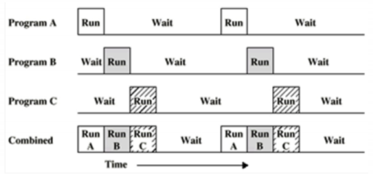
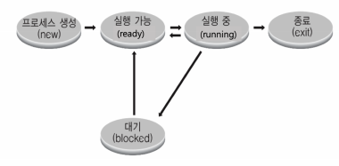
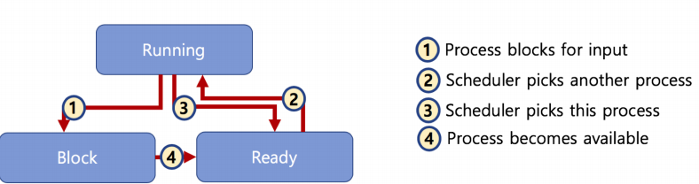

스케줄링 알고리즘
========

### 프로세스 상태와 스케줄링

**멀티 프로그래밍과 Wait**

- 멀티 프로그래밍 : CPU 활용도를 극대화 하는 스케줄링 알고리즘
- Wait : 간단히 저장매체로부터 파일 읽기를 기다리는 시간으로 가정

**프로세스 상태**

- running state : 현재 CPU에서 실행 상태
- ready state : CPU에서 실행 가능 상태(실행 대기 상태)
- block state: 특정 이벤트 발생 대기 상태(예:프린팅이 다 되었다)

**프로세스 상태간 관계**

- ready, running, block states

