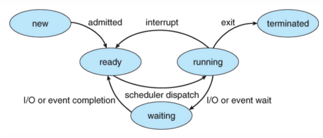
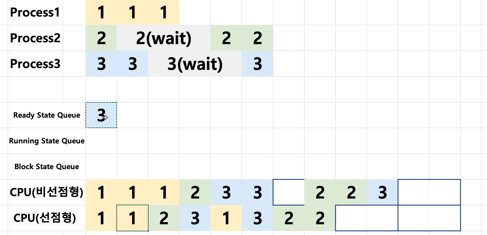

# 프로세스 상태기반 스케줄링 알고리즘 기본

### 선점형과 비선점형 스케줄러

- 선점형 스케줄러 (Preemptive Scheduling)
	: 하나의 프로세스가 다른 프로세스 대신에 프로세서(CPU)를 차지할 수 있음
- 비선점형 스케줄러 (Non-preemptive Scheduling)
	: 하나의 프로세스가 끝나지 않으면 다른 프로세스는 CPU를 사용할 수 없음

### 선점형과 비선점형 스케줄러 차이

- 비선점형: 프로세스가 자발적으로 blocking 상태로 들어가거나, 실행이 끝났을 때만, 다른 프로세스로 교체 가능

- 선점형 : 프로세스 running 중에 스케줄러가 이를 중단시키고, 다른 프로세스로 교체 가능

### 스케줄러 구분

- FIFO(FCFS), SJS, Priority-based는 어떤 프로세스를 먼저 실행시킬지에 대한 알고리즘
- RoundRobin은 시분할 시스템을 위한 기본 알고리즘 (선점형 스케줄러)

> - 리눅스 스케줄러 : O(1), CFS와 같이 다양한 방식으로 변경시도 중
	>   - 인터렉티브, IO, CPU 중심 프로세스로 미리 구분할 수 있다면 보다 개선된 스케줄링이 가능

1. 시분할
2. 프로세스 상태 고려
3. 정적 우선순위 기반
4. 선점형

이것들을 잘 조합해서 스케줄링을 할 수 있다.