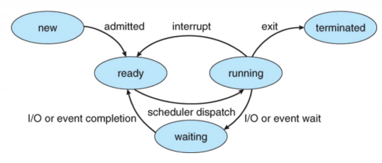
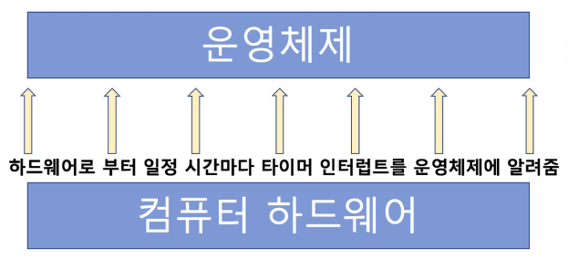

# 인터럽트


### 인터럽트란?

- CPU가 프로그램을 실행하고 있을 때, 입출력 하드웨어 등의 장치나 도는 예외상황이 발생하여 처리가 필요한 경우에 CPU에 알려서 처리하는 기술

> 어느 한순간 CPU가 실행하는 명령은 하나! 다른 장치와 어떻게 커뮤니케이션을 할까?


### 인터럽트 필요 이유

- 선점형 스케줄러 구현
	- 프로세스 running 중에 스케줄러가 이를 중단시키고, 다른 프로세스로 교체하기 위해, 현재 프로세스 실행을 중단시킴

- IO Device와의 커뮤니케이션
  - 저장매체에서 데이터 처리 완료시, 프로세스를 깨워야 함 (block state -> ready state)

- 예외 상황 핸들링
  - CPU가 프로그램을 실행하고 있을 때, 입출력 하드웨어 등의 장치나 또는 예외상황이 발생한 경우, CPU가 해당 처리를 할 수 있도록 CPU에 알려줘야 함




### 인터럽트 처리 예

- CPU가 프로그램을 실행하고 있을 때,
  - 입출력 하드웨어 등의 장치 이슈 발생
    - 파일 처리가 끝났다는 것을 운영체제에 알려주기
    - 운영체제는 해당 프로세스를 block state에서 실행 대기(ready) 상태로 프로세스 상태 변경하기
  - 또는 예외 상황이 발생
    - 0으로 나누는 계산이 발생해서, 예외 발생을 운영체제에 알려주기
    - 운영체제가 해당 프로세스 실행 중지/에러 표시


### 이벤트와 인터럽트

- 인터럽트는 일종의 이벤트로 불림
- 이벤트에 맞게 운영체제가 처리


### 주요 인터럽트 (Interrupt)

1. 계산하는 코드에서 0으로 나노는 코드 실행시
   - 컴파일시에는 에러가 안 남 / CPU에 코드를 실행시킬 때 에러가 난다.

```c++
#include <stdio.h>

int main()
{
    printf("Hello World!\n");
    int data;
    int divider = 0;
    data = 1 / divider; // 이 부분에서 인터럽트 발생
    return 0;
}
```


2. 타이머 인터럽트
   - 선점형 스케줄러를 위해 필요



3. 입출력(IO) 인터럽트
   - 프린터, 키보드, 마우스, SSD


### 인터럽트 종류

- 내부 인터럽트
  - 주로 프로그램 내부에서 잘못된 명령 또는 잘못된 데이터 사용시 발생
    - 0으로 나눴을 때
    - 사용자 모드에서 허용되지 않은 명령 또는 공간 접근시
    - 계산 결과가 Overflow/Underflow날 때

> 내부 인터럽트는 주로 프로그램 내부에서 발생하므로, 소프트웨어 인터럽트라고 함

- 외부 인터럽트
  - 주로 하드웨어에서 발생되는 이벤트(프로그램 외부)
    - 전원 이상
    - 기계 문제
    - 키보드등 IO 관련 이벤트
    - Timer 이벤트

> 외부 인터럽트는 주로 하드웨어에서 발생하므로, 하드웨어 인터럽트라고도 함


