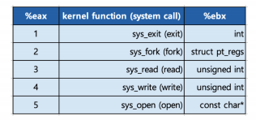
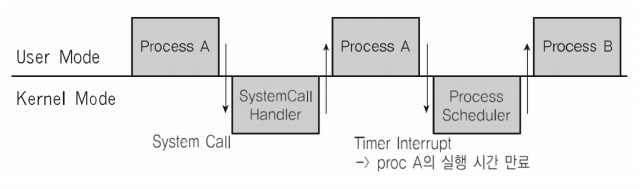
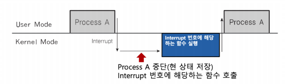

# 인터럽트


### 인터럽트란?

- CPU가 프로그램을 실행하고 있을 때, 입출력 하드웨어 등의 장치나 도는 예외상황이 발생하여 처리가 필요한 경우에 CPU에 알려서 처리하는 기술

> 어느 한순간 CPU가 실행하는 명령은 하나! 다른 장치와 어떻게 커뮤니케이션을 할까?


### 인터럽트 필요 이유

- 선점형 스케줄러 구현
	- 프로세스 running 중에 스케줄러가 이를 중단시키고, 다른 프로세스로 교체하기 위해, 현재 프로세스 실행을 중단시킴

- IO Device와의 커뮤니케이션
  - 저장매체에서 데이터 처리 완료시, 프로세스를 깨워야 함 (block state -> ready state)

- 예외 상황 핸들링
  - CPU가 프로그램을 실행하고 있을 때, 입출력 하드웨어 등의 장치나 또는 예외상황이 발생한 경우, CPU가 해당 처리를 할 수 있도록 CPU에 알려줘야 함


### 인터럽트 처리 예

- CPU가 프로그램을 실행하고 있을 때,
  - 입출력 하드웨어 등의 장치 이슈 발생
    - 파일 처리가 끝났다는 것을 운영체제에 알려주기
    - 운영체제는 해당 프로세스를 block state에서 실행 대기(ready) 상태로 프로세스 상태 변경하기
  - 또는 예외 상황이 발생
    - 0으로 나누는 계산이 발생해서, 예외 발생을 운영체제에 알려주기
    - 운영체제가 해당 프로세스 실행 중지/에러 표시


### 이벤트와 인터럽트

- 인터럽트는 일종의 이벤트로 불림
- 이벤트에 맞게 운영체제가 처리


### 주요 인터럽트 (Interrupt)

1. 계산하는 코드에서 0으로 나노는 코드 실행시
   - 컴파일시에는 에러가 안 남 / CPU에 코드를 실행시킬 때 에러가 난다.

```c++
#include <stdio.h>

int main()
{
    printf("Hello World!\n");
    int data;
    int divider = 0;
    data = 1 / divider; // 이 부분에서 인터럽트 발생
    return 0;
}
```


2. 타이머 인터럽트
   - 선점형 스케줄러를 위해 필요


3. 입출력(IO) 인터럽트
   - 프린터, 키보드, 마우스, SSD


### 인터럽트 종류

- 내부 인터럽트
  - 주로 프로그램 내부에서 잘못된 명령 또는 잘못된 데이터 사용시 발생
    - 0으로 나눴을 때
    - 사용자 모드에서 허용되지 않은 명령 또는 공간 접근시
    - 계산 결과가 Overflow/Underflow날 때

> 내부 인터럽트는 주로 프로그램 내부에서 발생하므로, 소프트웨어 인터럽트라고 함

- 외부 인터럽트
  - 주로 하드웨어에서 발생되는 이벤트(프로그램 외부)
    - 전원 이상
    - 기계 문제
    - 키보드등 IO 관련 이벤트
    - Timer 이벤트

> 외부 인터럽트는 주로 하드웨어에서 발생하므로, 하드웨어 인터럽트라고도 함


### 시스템 콜 인터럽트

- 시스템콜 실행을 위해서는 강제로 코드에 인터럽트 명령을 넣어, CPU에게 실행시켜야 한다.

- 시스템 콜 실제 코드
  - eax레지스터에 시스템 콜 번호를 넣고,
  - ebx레지스터에는 시스템 콜에 해당하는 인자값을 넣고,
  - 소프트웨어 인터럽트 명령을 호출하면서 0x80값을 넘겨줌

```c++
mov eax, 1
mov ebx, 0
int 0x80  (인터럽트 번호)//시스템 콜
```


### 인터럽트와 시스템 콜 (고급)

- 시스템콜 인터럽트 명령을 호출하면서 0x80값을 넘겨줌
  1. CPU는 사용자 모드를 커널 모드로 바꿔줌
  2. IDT(Interrupt Descriptor Table)에서 0x80에 해당하는 주소(함수)를 찾아서 실행함
  3. system_call()함수에서 eax로부터 시스템 콜 번호를 찾아서, 해당 번호에 맞는 시스템콜 함수로 이동
  4. 해당 시스템콜 함수 실행 후, 다시 커널 모드에서 사용자 모드로 변경하고, 다시 해당 프로세스 다음 코드 진행




### 사용자/커널 모드와 프로세스, 인터럽트




### 인터럽트와 IDT

- 인터럽트는 미리 정의되어 각각 번호와 실행 코드를 가리키는 주소가 기록되어 있음
  - 어디에? IDT(Interrupt Descriptor Table)에 기록
  - 언제? 컴퓨터 부팅시 운영체제가 기록
  - 어떤 코드? 운영체제 내부 코드

- 다시 예를 보면,
  - 항상 인터럽트 발생시, IDT를 확인
  - 시스템콜 인터럽트 명령은 0x80번호가 미리 정의
  - 인터럽트 0x80에 해당하는 운영체제 코드는 system_call()이라는 함수
  - 즉, IDT에는 0x80 -> system_call()와 같은 정보가 기록되어 있음
- 리눅스의 예
  - 0 ~ 31 : 예외상황 인터럽트 (일부틑 정의안된 채로 남겨져 있음)
  - 32 ~ 47 : 하드웨어 인터럽트 (주변장치 종류/객수에 따라 변경 가능)
  - 128 : 시스템 콜


### 인터럽트와 프로세스

1. 프로세스 실행 중 인터럽트 발생
2. 현 프로세스 실행 중단
3. 인터럽트 처리 함수 실행 (운영체제)
4. 현 프로세스 재실행




### 인터럽트와 스케줄러

> 선점형 스케줄러 구현 예

- 수시로 타이머 인터럽트 발생
  - 운영체제가 타이머 인터럽트 발생 횟수를 기억해서 5번 타이머 인터럽트 발생하면, 현재 프로세스를 다른 프로세스로 바꿔준다.