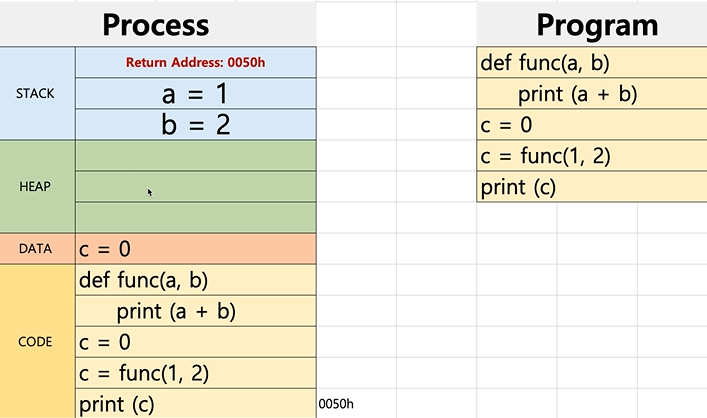
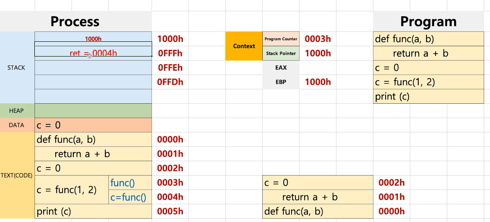
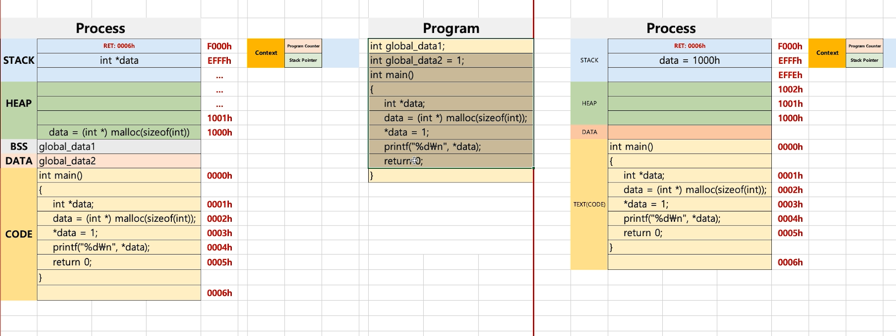
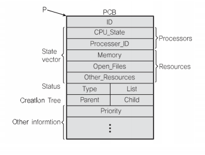

# 프로세스와 컨텍스트 스위칭

ㅡ프로세스 구조 deep dive





### 프로세스와 컨텍스트 스위칭

- 프로세스 (process)는 일반적으로 어떻게 구성되어 있을까?
  - text(CODE) : 코드
  - data :변수/초기화된 데이터
  - stack : 임시 데이터 (함수 호출, 로컬 변수등)
  - heap : 코드에서 동적으로 만들어지는 데이터

> malloc() <- c언어 동적으로 생성되는 공간 이것을 heap

- PC(Program Counter) + SP(Stack Pointer)




### Heap이란?

```c++
#include <stdio.h>
#include <stdlib.h>

int main(){
    int *data; //포인터 변수
    data = (int *) malloc(sizeof(int))
    *data = 1;
    printf("%d\n", *data);
    
    return 0;
}
```

> HEAP
>
> data = (int *) malloc(sizeof(int))
>
> malloc 동적으로 영역을 생성하는 함수
>
> free는 해제


### 프로세스 구조: Stack, HEAP, DATA(BSS,DATA), TEXT(CODE)

> DATA를 BSS와 DATA로 분리
>
> BSS : 초기화되지 않은 전역변수
>
> DATA : 초기화된 전역변수


- 스택 오버플로우 : 주로 해커들의 공격에 활용되었음


### 프로세스와 컨텍스트 스위칭

> 다시 PC, SP에 주목
>
> Stack, HEAP, DATA(BSS, DATA) TEXT(CODE)


### PCB

> PC, SP는 어디에 저장할까?

Proceess Control Block(PCB)에 저장한다.

> Process Context Block 이라고도 함

1. Process ID

2. Regitster 값 (PC, SP 등)

3. Scheduling Info (Process State)

4. Memory Info (메모리 사이즈 limit)

   ...

> PCB : 프로세스가 실행중인 상태를 캡쳐/구조화해서 저장




> Context Switch (program context, stack pointer) - 이 값을 PCB에 저장하고 새로운 Process가 실행 되는 것


### PCB : 리눅스 예

1. Process ID
2. Register (PC, SP 등)
3. Scheduling Info (Process State)
4. Memory Info (메모리 사이즈 limit)




### 정리

- 프로세스 구조
  - Stack, HEAP, DATA(BSS, DATA), TEXT(CODE)
- PCB
  - 프로세스 상태 정보 - PC, SP, 메모리, 스케줄링 정보 등

> 컨텍스트 스위칭 오래 걸리기 때문에 빠른 어셈블리어로 작성되어 있는 경우가 많다.