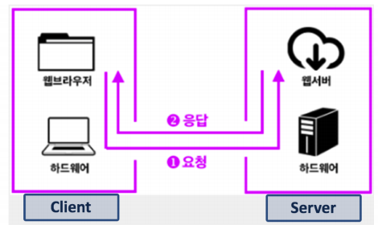
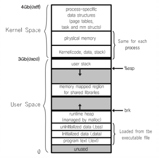
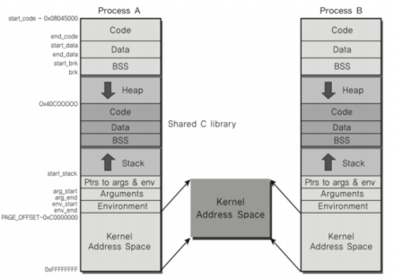

# 프로세스간 커뮤니케이션

-InterProcess Communication

### 프로세스간 커뮤니케이션

> 프로세스들이 서로의 공간을 쉽게 접근할 수 있다면? 
>
> -- 프로세스 데이터/코드가 바뀔 수 있니 위험하다

- 프로세스는 다른 프로세스의 공간을 접근할 수 없다.

### IPC (InterProcess Communication)

> 프로세스간에 커뮤니케이션을 해야한다면 어떻게 해야할까?

- 프로세스간 통신 방법을 제공함
- IPC : InterProcess Communication

### 프로세스간 통신이 필요할까?

- 성능을 높이기 위해 여러 프로세스를 만들어서 동시 실행
- 이 때 프로세스간 상태 확인 및 데이터 송수신이 필요

### 가볍게 생각해보기

- fork()시스템콜
  - fork()함수로 프로세스 자신을 복사해서 새로운 프로세스로 만들 수 있음
    - 부모 프로세스, 자식 프로세스
- 프로세스를 fork()해서, 여러 프로세스를 동시에 실행시킬 수 있음

> CPU를 동시 실행 가능 (병렬 처리)

- 여러 프로세스 동시 실행
- 1 ~ 10000까지 더하기
  - 각각 더한 값을 모두 더 함

> 이 때 각 프로세스가 더한 값을 수집해야 하므로, 프로세스간 통신 필요

- 웹서버 예
- 웹서버 만들기
  - 웹서버란? 요청이 오면, HTML 파일을 클라이언트에 제공하는 프로그램
  - 새로운 사용자 요청이 올 때마다, fork()함수로 새로운 프로세스 만들고, 각 사용자 요청에 즉시 대응

> CPU 병렬 처리가 가능하면, 더 빠른 대응이 가능

### 파일을 사용한 커뮤니케이션

> 프로세스간에 커뮤니케이션을 어떻게 해야할까

- IPC 중 한 가지 방법: file 사용

> 간단히 다른 프로세스에 전달할 내용을 파일에 쓰고, 다른 프로세스가 해당 파일을 읽으면 됨

- file을 사용하면, 실시간으로 직접 원하는 프로세스에 데이터 전달이 어려움
  - 왜? 해당 프로세스가 파일을 읽어야 하는데 계속 실시간으로 읽고만 있을 수 없다

> 그래서 보다 다양한 IPC기법이 존재

### 실제 프로세스 : 리눅스

- 프로세스간 공간은 완전히 분리되어 있다.

- 커널 공간은 공유한다.

### 다양한 IPC 기법

1. file 사용

2. Message Queue

3. Shared Memory

4. Pipe

5. Signal

6. Semaphore

7. Socket

   ...

> 2번부터는 모두 커널 공간을 사용하는 것

### 정리

- 여러 프로세스 동시 실행을 통한 성능 개선, 복잡한 프로그램을 위해 프로세스간 통신 필요
- 프로세스간 공간이 완전 분리
- 프로세스간 통신을 위한 특별한 기법 필요
  - IPC
- 대부분의 IPC 기법은 결국 커널 공간을 활용하는 것
  - 이유 : 커널 공간은 공유하기 때문