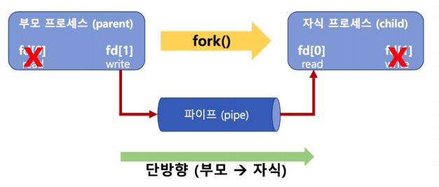
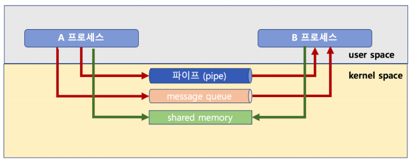

# 프로세스간 커뮤니케이션

- 각 IPC 기법 개념 이해하기


### 파이프

- pipe(파이프)
  - 기본 파이프는 단방향 통신
  - fork()로 자식 프로세스 만들었을 때, 부모와 자식간의 통신




```c++
char* msg = "Hello Child Process!";

int main(){
    char buf[255];
    int fd[2], pid, nbytes;
    if (pipe(fd) < 0) // pipe(fd)로 파이프 생성
    	exit(1);
    pid = fork(); // 이 함수 실행 다음 코드부터 부모/자식 프로세스로 나뉘어짐
    if(pid > 0){//부모 프로세스는 pid에 실제 프로세스 ID가 들어감
        write(fd[1], msg, MSGSIZE); //fd[1]에 쓴다.
        exit(0);
    }
    else{// 자식 프로세스는 pid가 0이 들어감
        nbytes = read(fd[0], buf, MSGSIZE); //fd[0]으로 읽음
        printf("%d %s\n", nbytes, buf);
        exit(0);
    }
    return 0;
}
```


### 메시지 큐 (message queue)

- A 프로세스

```c
msqid = msgget(key, msgflg) //key는 1234, msgflg는 옵션
msgsnd(msqid, &sbuf, buf_length, IPC_NOWAIT)
```

- B 프로세스

```c
msqid = msgget(key, msgflg) //key는 1234로 해야 해당 큐의 msgid를 얻음
msgrcv(msqid, &rbuf, MSGSZ, 1, 0)
```


### 파이프와 메시지 큐

- message queue는 부모/자식이 아니라 , 어느 프로세스간에라도 데이터 송수신이 가능
- 먼저 넣은 데이터가 먼저 읽힌다.

### PIPE VS message queue

- 부모/자식 프로세스간 only or not
- 단방향만 가능 or 양방향 가능


### 공유 메모리 (shared memory)

- 노골적으로 kernel space에 메모리 공간을 만들고, 해당 공간을 변수처럼 쓰는 방식
- message queue처럼 FIFO방식이 아니라, 해당 메모리 주소를 마치 변수처럼 접근하는 방식
- 공유메모리 key를 가지고, 여러 프로세스가 접근 가능



1. 공유 메모리 생성 및 공유 메모리 주소 얻기

```c
shmid = shmget((key_t)1234, SIZE, IPC_CREATE|0666)
shmaddr = shmat(shmid, (void *)0, 0)
```

2. 공유 메모리에 쓰기

```c
strcpy((char *)shmaddr, "Linux Programming")
```

3. 공유 메모리에서 읽기

```c
printf("%s\n", (char *)shmaddr)
```


### 정리

1. 주요 IPC 기법
   - pipe
   - message queue
   - shared memory
2. 모두 커널 공간을 활용해서 프로세스간 데이터 공유