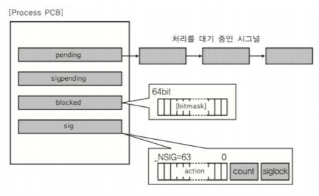
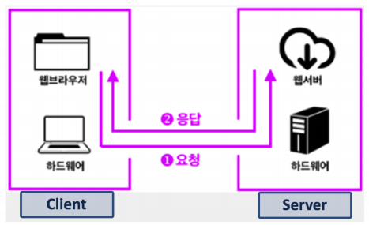
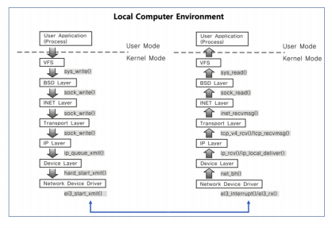

# 프로세스간 커뮤니케인션

- 각 IPC 기법 개념 이해하기 (signal과 socket)


> IPC기법이지만, 이외에도 많이 사용되는 두 가지 기술

- 많이 사용하는 두 가지
  - 시그널(signal)
  - 소켓(socket)


### 시그널

- 유닉스에서 30년 이상 사용된 전통적인 기법
- 커널 또는 프로세스에서 다른 프로세스에 어떤 이벤트가 발생되었는지를 알려주는 기법
- 프로세스 관련 코드에 관련 시그널 핸들러를 등록해서, 해당 시그널 처리 실행
  1. 시그널 무시
  2. 시그널 블록(블록을 푸는 순간, 프로세스에 해당 시그널 전달)
  3. 등록된 시그널 핸들러로 특정 동작 수행
  4. 등록된 시그널 핸들러가 없다면, 커널에서 기본 동작 수행


### 주요 시그널

> 주요 시그널: 기본 동작

- SIGKILL : 프로세스를 죽여라 (슈퍼관리자가 사용하는 시그널로, 프로세스는 어떤 경우든 죽도록 되어 있다.)
- SIGALARM : 알람을 발생한다
- SIGSTP : 프로세스를 멈춰라 (Ctrl + z)
- SIGCONT : 멈춰진 프로세스를 실행해라
- SIGINT : 프로세스에 인터럽트를 보내서 프로세스를 죽여라 (Ctrl + c)
- SIGSEGV : 프로세스가 다른 메모리영역을 침범했다.

> 시그널 종류 : kill -l


### 시그널 관련 코드 예제

- 시그널 핸들러 등록 및 핸들러 구현

```c
static void signal_handler (int singo){
	printf("Catch SIGINT!\n");
	exit(EXIT_SUCCESS;
}

int main(void){
	if(signal(SIGINT, signal_handler) == SIG_ERR){
		printf("Can't catch SIGINT!\n");
		exit(EXIT_FAILURE);
	}
	for(;;)
		pause();
	return 0;
}
```


### 시그널과 프로세스

- PCB에 해당 프로세스가 블록 또는 처리해야하는 시그널 관련 정보 관리

> 커널모드 사용자 모드로 전환시 시그널을 사용한다.




### 소켓(socket)

- 소켓은 네트워크 통신을 위한 기술
- 기본적으로는 클라이언트와 서버등 두 개의 다른 컴퓨터간의 네트워크 기반 통신을 위한 기술




### 소켓과 IPC

- 소켓을 하나의 컴퓨터 안에서, 두 개의 프로세스간에 통신 기법으로 사용 가능




### 정리

- 다양한 IPC 기법을 활용해서, 프로세스간 통신이 가능하다.
- IPC 기법 이외에도 사용할 수 있는 다음 두 가지 기술 개념을 알아두자.
  - 시그널(signal)
  - 소켓


> 빈번한 IO처리는 overhead가 올라감
>
> 한 번에 메모리에 올리고 처리하려고 노력을 많이한다.
>
> 빅데이터 Spark도 메모리에 올리고 처리하는 것을 이용