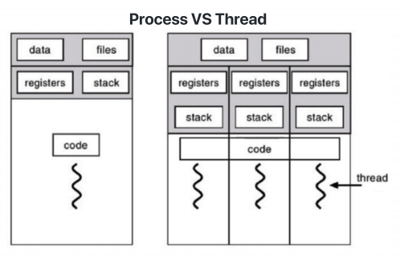
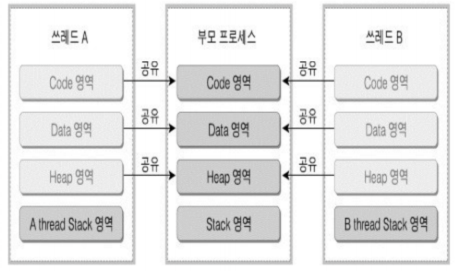
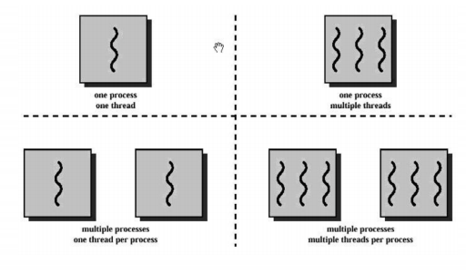
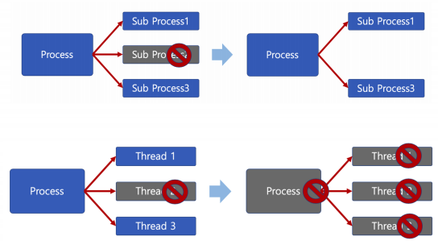

# Thread (스레드)

### Thread (스레드)

- Light Weight Process라고도 함
- 프로세스
  - 프로세스 간에는 각 프로세스의 데이터 접근이 불가
- 스레드
  - 하나의 프로세스에 여러개의 스레드 생성 가능
  - 스레드들은 동시에 실행 가능
  - 프로세스 안에 있으므로, 프로세스의 데이터를 모두 접근 가능

#### Thread는 각기 실행이 가능한 stack 존재

Stack과 Heap 사이에 영역을 만들어서 thread1, 2, 3 을 위한 영역을 만들었다.

다른 영역은 공유

### Multi Thread (멀티 스레드)

- 소프트웨어 병행 작업 처리를 위해 Multi Thread를 사용함

- 멀티 태스킹 : 하나에 CPU에 여러 process
- 멀티 프로세싱 : 여러 CPU에서 병렬실행
- Thread : 멀티 코어 환경에서 유용

### Thread 장점

1. 사용자에 대한 응답성 향상

2. 자원 공유 효율
   - IPC 기법과 같이 프로세스간 자원 공유를 위해 번거러운 작업이 필요 없음
   - 프로세스 안에 있으므로, 프로세스의 데이터를 모두 접근 가능

3. 작업이 분리되어 코드가 간결
   - 사실 작성하기 나름

### Thread 단점

- 스레드 중 한 스레드만 문제가 있어도, 전체 프로세스가 영향을 받음
- 멀티 프로세스, 멀티 스레드

- 스레드를 많이 생성하면, Context Switching이 많이 일어나, 성능 저하
- 예 : 리눅스 OS에서는 Thread를 Process와 같이 다룸
  - 스레드를 많이 생성하면, 모든 스레드를 스케줄링해야 하므로, Context Switching이 빈번하다.

### Thread vs Procss

- 프로세스는 독립적, 스레드는 프로세스의 서브셋
- 프로세스는 각각 독립적인 자원을 가짐, 스레드는 프로세스 자원 공유
- 프로세스는 자신만의 주소영역을 가짐, 스레드는 주소영역 공유
- 프로세스간에는 IPC기법으로 통신해야 함, 스레드는 필요 없음

### PThread

- POSIX스레드 (POSIX Threads)
  - Thread 관련 표준 API

