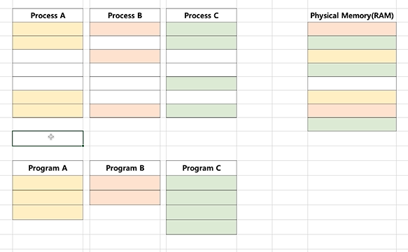

# 가상 메모리의 이해 - 가상 메모리 개념

### 가상 메모리 (Virtual Memory System)

> 실제 각 프로세스마다 충분한 메모리를 할당하기에는 메모리 크기가 한계가 있음

- 예 : 리눅스는 하나의 프로세스가 4GB임
- 통상 메모리는 8GB? 16GB?

> 폰노이만 구조 기반이므로, 코드는 메모리에 반드시 있어야 함

 프로세스는 특정 시간에 특정 영역만 사용할 것이다.

### 가상 메모리가 필요한 이유

- 하나의 프로세스만 실행 가능한 시스템 (배치 처리 시스템등)
  1. 프로그램을 메로리로 로드(load)
  2. 프로세스 실행
  3. 프로세스 종료 (메모리 해제)
- 여러 프로세스 동시 실행 시스템
  1. 메모리 용량 부족 이슈
  2. 프로세스 메모리 영역간에 침범 이슈

### 가상 메모리

- 가상 메모리: 메모리가 실제 메모리보다 많아 보이게 하는 기술 
  - 실제 사용하는 메모리는 작다는 점에 착안해서 고안된 기술 
  - 프로세스간 공간 분리로, 프로세스 이슈가 전체 시스템에 영향을 주지 않을 수 있음

- 가상 메모리 기본 아이디어 
  - 프로세스는 가상 주소를 사용하고, 실제 해당 주소에서 데이터를 읽고/쓸때만 물리 주소로 바꿔주면 된다. 
  - virtual address (가상 주소): 프로세스가 참조하는 주소 
  - physical address (물리 주소): 실제 메모리 주소 
- MMU(Memory Management Unit) 
  - CPU에 코드 실행시, 가상 주소 메모리 접근이 필요할 때, 해당 주소를 물리 주소값으로 변환해주는 하드웨어 장치

### 가상 메모리와 MMU

- CPU는 가상 메모리를 다루고, 실제 해당 주소 접근시 MMU 하드웨어 장치를 통해 물리 메모리 접근
  - 하드웨어 장치를 이용해야 주소 변환이 바르기 때문에 별도 장치를 둠

