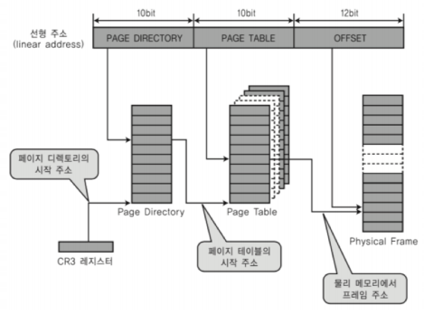
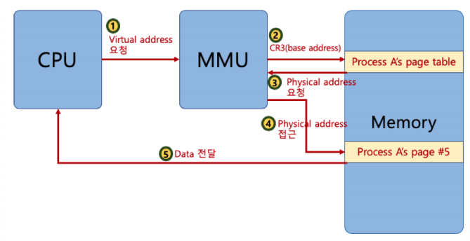
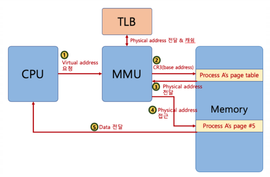
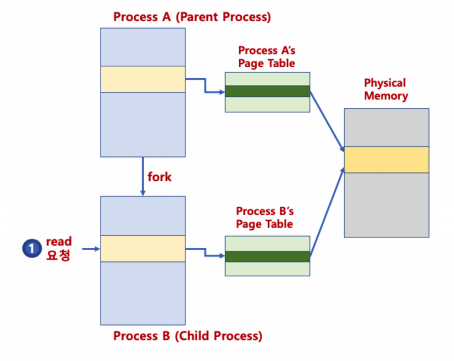
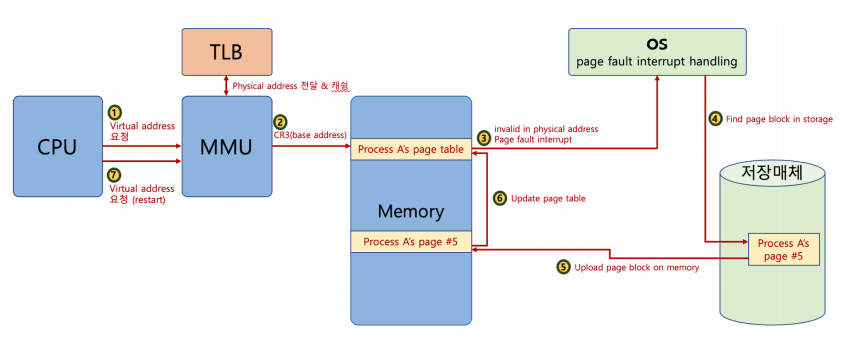

# 다중 단계 페이징 시스템

### 다중 단계 페이징 시스템

- 32bit 시스템에서 4KB 페이지를 위한 페이징 시스템은
  - 하위 12bit 는 오프셋
  - 상위 20bit가 페이징 번호이므로 2의 20승개의 페이지 정보가 필요함
- 페이징 정보를 단계를 나우어 생성
  - 필요없는 페이지는 생성하지 않으면, 공간 절약 가능

- 페이지 번호를 나타내는 bit를 구분해서, 단계를 나눔 (리눅스는 3단계, 최근 4단계)

### MMU와 TLB(컴퓨터 구조)

- MMU가 물리 주소를 확인하기 위해 메모리를 갔다와야 함

  

- TLB(Translation Lookaside Buffer) : 페이지 정보 캐쉬

### 페이징 시스템과 공유 메모리

- 프로세스간 동일한 물리 주소를 가리킬 수 있음 (공간 절약, 메모리 할당 시간 절약)

  

- 물리 주소 데이터 변경시
  
  - 물리 주소에 **데이터 수정 시도시, 물리 주소를 복사**할 수 있음 (copy-on-write)

### 요구 페이징 (Demand Paging)

- 프로세스 모든 데이터를 메모리로 적재하지 않고, 실행 중 필요한 시점에서만 메모리로 적재함

  - 선행 페이징의 반대 개념 : 미리 프로세스 관련 모든 데이터를 메모리에 올려놓고 실행하는 개념

  - 더 이상 필요하지 않은 페이지 프레임은 다시 저장매체에 저장 (페이지 교체 알고리즘 필요)

### 페이지 폴트 (page fault)

- 어떤 페이지가 실제 물리 메로리에 없을 때 일어나는 인터럽트
- 운영체제가 page fault가 일어나면, 해당 페이지를 물리 메모리에 올림

### 페이지 폴트와 인터럽트

### 생각해보기

- 페이지 폴트가 자주 일어나며?
  - 실행되기 전에, 해당 페이지를 물리 메모리에 올려야 함
    - 시간이 오래 걸림
- 페이지 폴트가 안 일어나게 하려면?
  - 향후 실행/참조될 코드/ 데이터를 미리 물리 메모리에 올리면 됨
    - 앞으로 있을 일을 예측해야 함 - 신의 영역