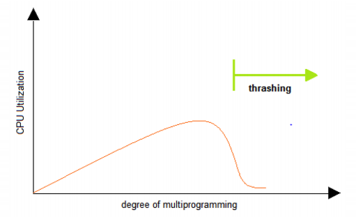
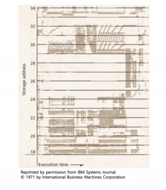

# 가상 메모리의 이해 - 페이지 교체 알고리즘

### 페이지 교체 알고리즘 (FIFO)

- FIFO Page Replacement Algorithm
  - 가장 먼저 들어온 페이지를 내린다

### 페이지 교체 알고리즘 (OPT)

- 최적 페이지 교체 알고리즘 (OPTimal Replacement Algorithm)
  - 앞으로 가장 오랫동안 사용하지 않을 페이지를 내리자
  - 일반 OS에서는 구현 불가

### 페이지 교체 알고리즘 (LRU)

- LRU(Least Recently Used) Page Replacement Algorithm
  - 가장 오래 전에 사용된 페이지를 교체
  - OPT 교체 알고리즘이 구현이 불가하므로, 과거 기록을 기반으로 시도

### 페이지 스왑 알고리즘 (LFU)

- LFU(Least Frequently Used) Page Replacement Algorithm
  - 가장 적게 사용된 페이지를 내리자

### 페이지 스왑 알고리즘 (NUR)

- NUR (Not Used Recently) Page Replacement Algorithm
  - LRU와 마찬가지로 최근에 사용하지 않은 페이지부터 교체하는 기법
  - 각 페이지마다 참조 비트 (R), 수정 비트 (M)을 둠 (R,M)
    - (0,0), (0,1), (1,0), (1,1) 순으로 페이지 교체

### 스레싱 (Thrashing)

- 반복적으로 페이지 폴트가 발생해서, 과도하게 페이지 교체 작업이 일어나, 실제로는 아무일도 하지 못하는 상황

### 메모리 지역성

>  반복문을 생각한다면 코드 주변을 실행할 가능성이 높음