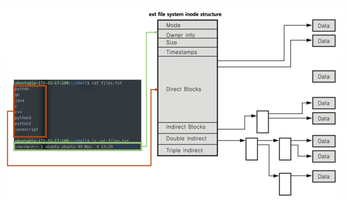
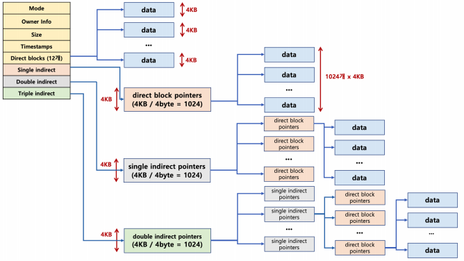
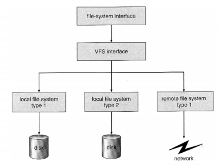

# 파일 시스템의 이해 - inode 방식과 가상 파일 시스템

### inode 방식 파일 시스템

- 파일 시스템 기본 구조
  - 수퍼 블록 :  파일 시스템 정보
  - 아이노드 블록 : 파일 상세 정보
  - 데이터 블록 : 실제 데이터

- 수퍼 블록: 파일 시스템 정보 및 파티션 정보 포함

- 파일 : inode 고유값과 자료구조에 의해 주요 정보 관리
  - 파일이름 : inode로 파일이름은 inode 번호와 매칭
  - 파일 시스템에서는 inode를 기반으로 파일 엑세스
  - inode 기반 메타 데이터 저장

### inode 구조

- inode 기반 메타 데이터 (파일 권한, 소유자 정보, 파일 사이즈, 생성기간등 시간 관련 정보, 데이터 저장 위치등)

### 디렉토리 엔트리

- 리눅스 파일 탐색 : 예 /home/ubuntu/link.txt
  1. 각 디렉토리 엔트리(dentry)를 탐색
     - 각 엔트리는 해당 디렉토리 파일/디렉토리 정보를 가지고 있음
  2. '/' dentry 에서 'home'을 찾고, 'home'에서 'ubuntu'를 찾고, 'ubuntu'에서 link.txt 파일이름에 해당하는 inode를 얻음

### 가상 파일 시스템 (Virtual File System)

- Network등 다양한 기기도 동일한 파일 시스템 인터페이스를 통해 관리 가능

- 예 : read/write 시스템콜 사용, 각 기기별 read_spec/write_spec 코드 구현

  (운영체제 내부)

### 참고: 리눅스(유닉스) 운영체제와 가상 파일 시스템

- 모든 것은 파일이라는 철학을 따름
  - 모든 인터렉션은 파일을 읽고, 쓰는 것처럼 이루어져 있음
  - 마우스, 키보드와 같은 모든 디바이스 관련된 기술도 파일과 같이 다루어짐
  - 모든 자원에 대한 추상화 인터페이스로 파일 인터페이스를 활용

### 참고: 특수 파일

- 디바이스

  - 블록 디바이스(Block Device)

    : HDD, CD/DVD와 같이 블록 또는 섹터 등 정해진 단위로 데이터 전송, IO송수신 속도가 높음

  - 캐릭터 디바이스(Character Device)

    : 키보드,마우스등 byte 단윈 데이터 전송, IO송수신 속도가 낮음

  - cd/dev, cat tty