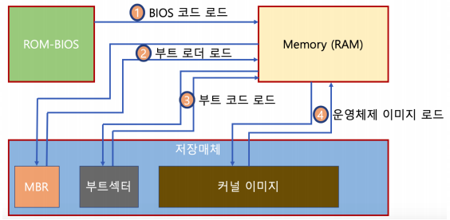

# 부팅의 이해

### Boot

- 컴퓨터를 켜서 동작시키는 절차
- Boot 프로그램
  - 운영체제 커널을 Storage에서 특정 주소의 물리 메모리로 복사하고 커널의 처음 실행위치로 PC를 가져다 놓는 프로그램

### 부팅 과정

- 컴퓨터를 키면
  - BIOS가 특정 Storage 읽어와 bootstrap loader를 메모리에 올리고 실행함
  - bootstrap loader 프로그램이 있는 곳을 찾아서 실행시킴

> MBR에 파티션 Table
>
> 파티션마다 부트섹터가 있다 부트 섹터는 부트 코드가 있고 커널 이미지를 읽어 낸다.
>
> 그러면 커널이 실행된다. 