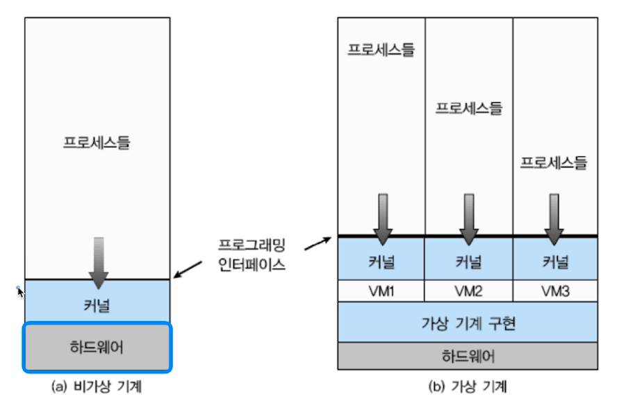
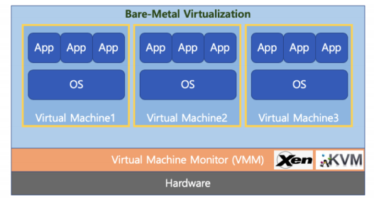
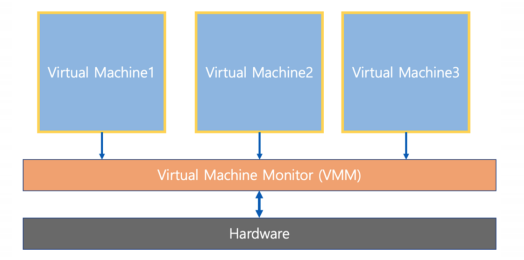
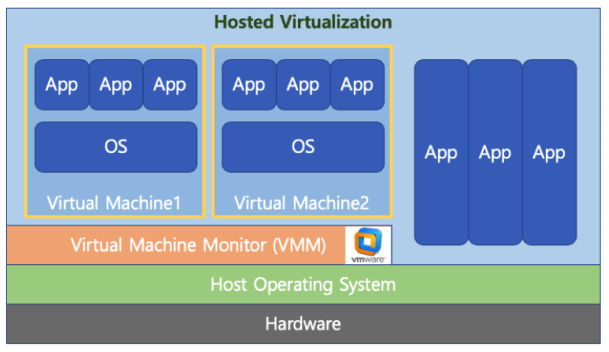
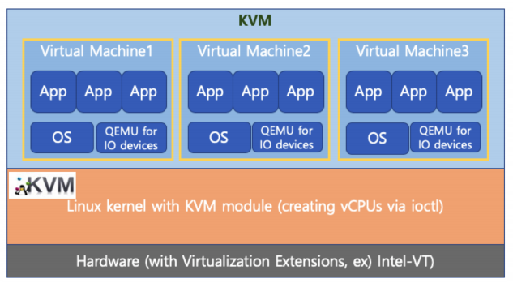
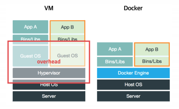

# 가상 머신의 이해


### Virtual Machine (가상 머신)

- 하나의 하드웨서 (CPU, Memory 등)에 다수의 운영체제를 설치하고, 개별 컴퓨터처럼 동작하도록 하는 프로그램





### Virtual Maching Type1 (native 또는 bare metal)

- 하이퍼 바이저(또는 VMM) : 운영 체제와 응용프로그램을 물리적 하드웨어에서 분리하는 프로세스
- 하이퍼바이저 또는 버추얼 머신 모니터 (VMM)라고 하는 소프트웨어가 Hardware에서 직접 구동
  - Xen, KVM




### Virtual Maching Type2

- 하이퍼바이저 도는 버추얼 머신 모니터 (VMM)라고 하는 소프트웨어가 Host OS 상위에 설치
  - VMWare, Parallels Desktop (Mac)


### Full Virtualization(전가상화) VS Half Virtualization(반가상화)

- 전가상화 : 각 가상머신이 하이퍼바이저를 통해서 하드웨어와 통신
  - 하이퍼바이저가 마치 하드웨어인 것처럼 동작하므로, 가상머신의 OS는 자신이 가상 머신인 상태인지를 모름

- 반가상화 : 각 가상머신에서 직접 하드웨어와 통신
  - 각 가상머신에 설치되는 OS는 가상 머신인 경우, 이를 인지하고, 각 명령에 하이퍼바이저 명령을 추가해서 하드웨어와 통신




### VMWare

- VMWare : 대중적인 가상머신 프로그램 (Type2)




### KVM

- AWS(아마존 클라우드 컴퓨팅 서비스)등에서 사용 (Type1)



- Intel-VT등 가상화 기능을 가진 CPU에서는 VMX root/VMX non-root모드 존재
- 각 모드별로 protection ring 0 ~ 3 지원, 가상화 기능을 사용하지 않을 경우, VMX root 모드사용
- KVM은 각 가상 시스템에 대응하는 KVM 프로세스 실행, KVM 모듈 (/dev/kvm)을 통해 vCPU 사용
- KVM 프로세스 기반 게스트 커널(VMX non-root / RING 0 사용), QEMU 장치 에뮬레이터가 로드됨
- 게스트 커널 위에서 실행되는 응용 프로그램은 VMX non-root / RING 3 사용
- 게스트 커널이 물리적 HW 자원 필요시, VM exit 가 발생, KVM 모듈에서 해당 요청 처리
- 일반 HW 자원은 QEMU 장치 에뮬레이터에서 처리
  - QEMU장치 에뮬레이터는 VMX root/ RING 3 를 통해, 호스트 커널에 요청 후, 해당 데이터는 공유 메모리를 통해 KVM 게스트 커널과 공유


### Docker (가상 머신 vs Docker)

- 가상 머신은 컴퓨터 하드웨어를 가상화 (하드웨어 전체 추상화)
  - 하이퍼바이저 사용, 추가 OS 필요등 성능 저하 이슈 존재
- Docker는 운영체제 레벨에서 별도로 분리된 실행환경을 제공 (커널 추상화)
  - 마치 리눅스 처음 설치했을때와 유사한 실행환경을 만들어주는 리눅스 컨테이너 기술 기반
  - 리눅스 컨테이너 기술이므로 macOS나 windows에 설치할 경우는 가상 머신 기반 제공




### 가상 머신 정리

- Bare-Metal 방식이 가장 성능이 좋음

  - 하드웨어 직접 엑세스하기 때문
  - AWS(클라우드 컴퓨팅)환경도 Bare-Metal 기반 가상 머신 기술 활용 (KVM)

- Docker는 경량 이미지로 실행환경을 통째로 백업, 실행 가능 (실무에 많이 사용됨)

  - Data Engineering에서 Docker로 시스템 환경 설정 + 프로그램을 한 번에 배포

  - 예: 프로그램 업데이트 -> Docker 이미지 작성 -> Jenkins로 배치잡 생성 및 실행

    (AWS EC2 재생성 및 Docker 이미지 설치, 실행)

```
docker pull ubuntu:latest
docker images
docker run -i -t --name hello ubuntu /bin/bash
docker start hello
docker restart hello
docker attach hello
```


### Java Virtual Machine

- 가상 머신과는 다른 목적 (응용프로그램 레벨 가상화)

- Java 컴파일러는 CPU dependency를 가지지 않는 bytecode를 생성함

- 이 파일을 Java Virtual Machine에서 실행함

- 각 운영체제를 위한 Java Virtual Machine 프로그램 존재

  

