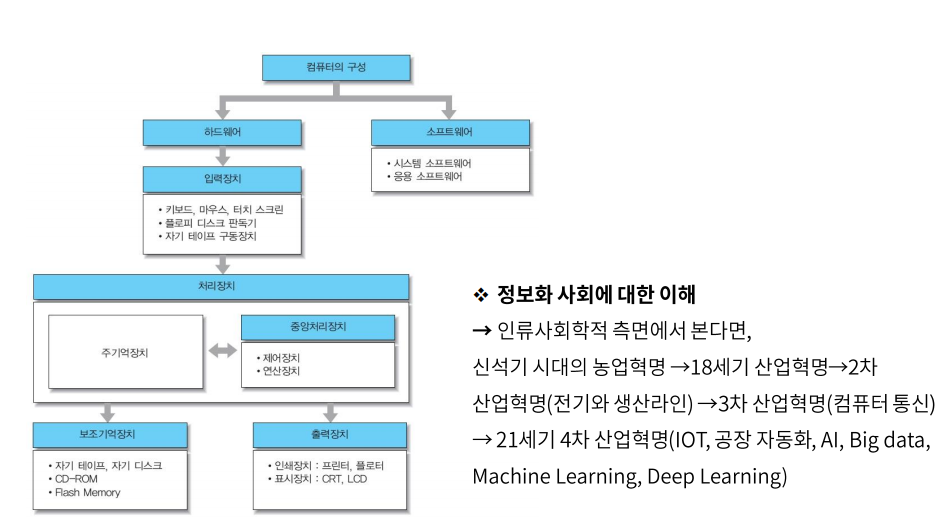
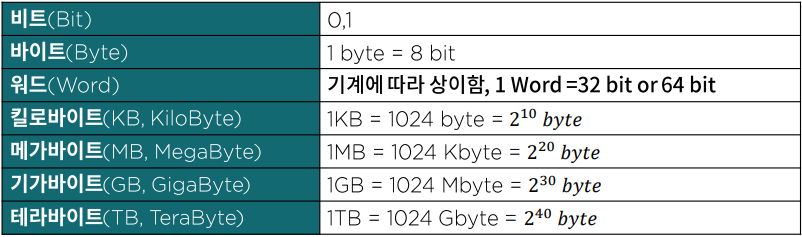

# 컴퓨터 시스템의 이해

### 왜 컴퓨터 구조를 학습해야 할까

- 현대의 컴퓨터란 어떤 기계인가?
- 상태 머신(State Machine)과 소프트웨어
- 우리가 이루려고 하는 목표는, 고성능, 저전력
- 결국은 도메인(Domain)의 문제

### 1.2 컴퓨터 하드웨어의 구성

프린터, 하드디스크, 모니터, 키보드, 마우스, 스피커

### 1.3 데이터의 표현

- 정보(information)
  - 어떤 사물에 대한 소식이나 자료
  - 가공된 데이터
- 데이터(data)
  - 정보를 작성하기 위해 필요한 자료나 정보를 처리하거나 전송할 때 이진(binary)이나 디지털과 같은 좀더 편리한 형태로 바뀌어진 자료
  - 정보의 원재료

### 1.4 데이터 표현 및 단위

- 수치 데이터 : 연산용 데이터
- 비 수치 데이터 : 입출력용 데이터
- 특수문자 : 입출력/연산용 데이터

### 컴퓨터 구조로 본 패러다임의 변화

- 컴퓨터의 태동
- 사무자동화 기계로 인식되던 시대
- 드디어 네트워크의 단말로, 공히 통신기기의 반열에 오르다.
- 과연 누가 컴퓨터의 미래를 예측할 수 있을까?
  - 유비쿼터스 시대의 도래
  - Mobile & Wireless 전성 시대
  - IOT 시대의 자화상
  - Smart Computer

