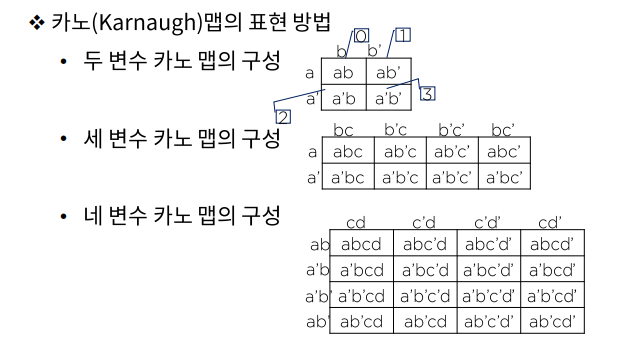

# 데이터의 표현 - 부울대수와 논리식의 간편화

### 부울 대수

참과 거짓을 판별 할 수 있는 논리적 명제를 수학적 표현의 논리 전개 식으로 구현한 것

### 부울 대수의 기본 법칙

- 교환법칙
- 결합법칙
- 분배법칙
- 드모르간의 정리

### 논리식의 간편화 카노(Karnaugh) 맵

논리 표현식은 부울 대수를 이용해 간단히 만들 수 있으나 여러가지 규칙이 있다.

맵 방법은 부울 함수를 곧바로 간소화 할 수 있으므로 널리 활용된다.

> 0 1 2 3
> 4 5 6 7

>0 1 2 3
>4 5 6 7
>8 9 10 11
>12 13 14 15

