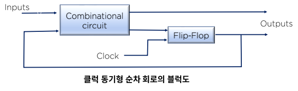
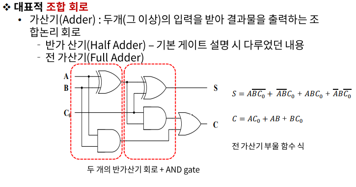
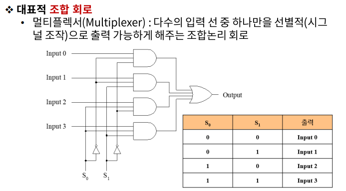
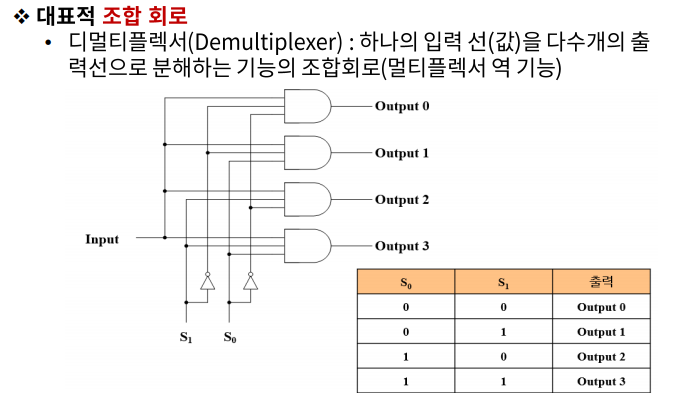
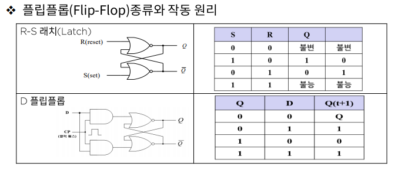
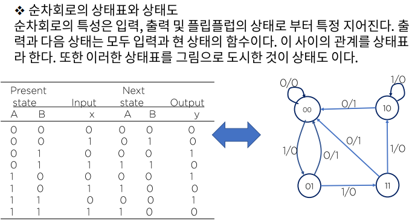

# 데이터의 표현 - 조합 & 기억 논리회로

### 조합논리 회로

- 조합 회로는 입력과 출력을 가진 논리 게이트의 집합으로 출력은 현재의 입력(0,1)값과 조합의 함수이며, 순차 논리회로는 게이트 뿐만 아니라 기억능력이 있는 플립플롭으로 구성된다.

### 조합 회로의 설계 절차

1. 문제가 제시 된다.
2. 입력과 출력 변수에 문자 기호를 붙인다.
3. 입력과 출력사이의 관계를 정의하는 **진리표를 유도** 한다.
4. 각 출력에 대한 간소화된 부울 함수를 얻는다.
5. 논리도를 작성한다.

### 기억회로의 구성 및 작동 원리

대부분의 디지털 시스템들이 조합회로를 가지고 있는 것은 사실이지만, 대부분의 경우 순차회로로 구현되는 저장요소를 필요로 한다. 우리는 이러한 종류의 회로를 플립플롭이라고 한다.

### 순차회로

순차회로는 플립플롭과 게이트를 서로 연결한 것이다. 게이트틀로만 이루어진 회로는 조합회로지만 플립플롭이 포함될 때 순차 회로가 된다. 순차회로의 외부 출력은 외부 입력과 플립플롭의 현상태의 함수로 표시된다.

