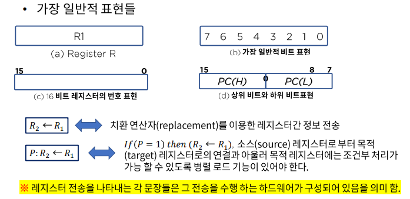
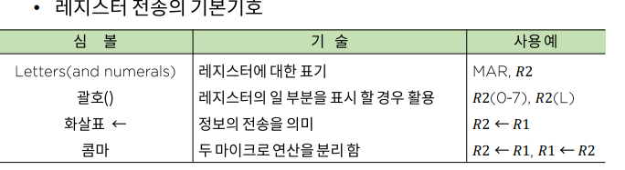
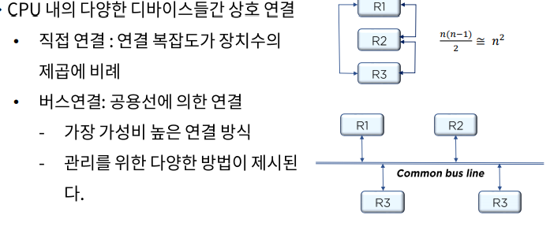

# CPU 내부 구조와 레지스터

### 명령어(instruction) 구성과 실행

- 명령어 코드

  컴퓨터의 구조는 내부 레지스터, 타이밍과 제어구조 명령어 집합에 의해 정의 된다.

- 레지스터 전송 언어

  레지스터(Register)에 저장된 데이터의 조작을 위해 실행되는 동작을 마이크로연산이라 함, 이는 하나의 클럭 펄스 내에서 실행되는 기본적인 동작

  (shift, count, clear, road ...)

- 디지털 컴퓨터의 구조를 정의하기 위하여 논의 되어야 할 내용
  - 레지스터의 종류와 그 기능
  - 레지스터에 저장된 이진 정보를 가지고 수행되는 일련의 마이크로 연산들
  - 일련의 마이크로 동작을 온/오프 시킬 수 있는 제어기능

- 레지스터 전송

### CPU 디자인

> H/W와 S/W는 최대한 서로 건들지 말아야한다.

>멀티 플렉서를 이용
>
>3 - 상태 버스 버퍼

>CPU디자인
>
>스택,큐,데크