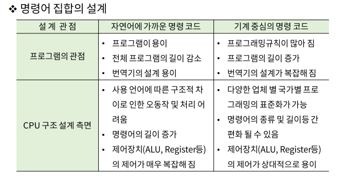
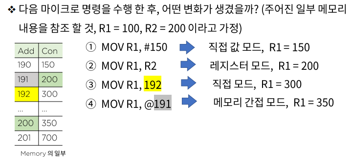

# 중앙처리장치 - 마이크로 명렁어 집합과 구성

### 실행 순서에 따른 명령어 분류

- 순차적 실행 명령어
- 분기 명령어
- 부 함수 호출 명령어
- 복귀 명령어

### 명령어 구문 형식

1. 명령 코드 : CPU가 실행할 수 있도록 디자인 된 연산
2. 오퍼랜드 : 연산에 사용되는 자료 값, 자료가 저장 된 주소에 관한 정보
3. 주소 지정 모드 : 오퍼랜드가 저장된 위치를 인덱싱하는 방법

### 주소 지정 모드

- 명령어의 구조상 자료가 저장되어 있는 장소를 지정하는 방법이 필요함, 이유는 최대한 하드웨어와 소프트웨어의 독립성을 유지하여 프로그램의 유연성(pointer, indexing)을 가능하게 하여 명령어의 수와 길이를 줄이기 위한 세계적 표준화 기법
- 묵지석 모드
  - NOP : NO operation, 오퍼랜드가 필요 없는 명령어
  - INC : 묵시적 오퍼랜드인 누산기의 연산 명령어
  - ADD : 스택 구조의 명령어(스택에 오퍼랜드가 저장)

> 직접 값 모드, 레지스터 모드, 메모리 직접 주소 모드

- 메모리 간접 주소 모드

  Ex) MOV  R1, @100; R1 <- M[100] 

  

