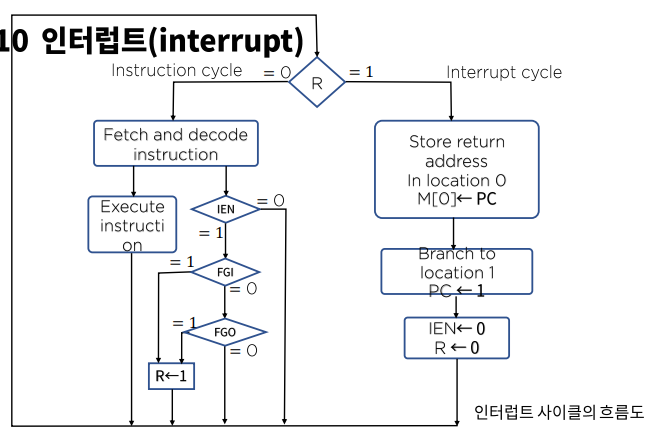
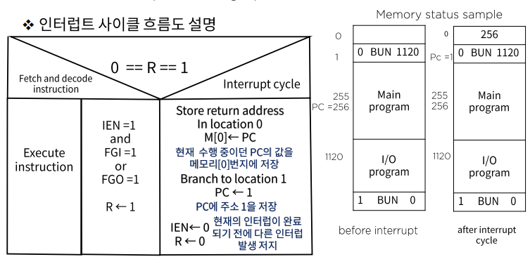

# 마이크로 명령 - 입출력과 인터럽트

### 입출력 구성

컴퓨터는 사용자와 통신을 하기 위해서 외부 장치, 즉 메모리로 데이터와 명령어를 읽어 들일 입력장치와 계산결과를 사용자에게 표시해 줄 출력장치를 갖추어야 한다. 오늘날 컴퓨터에는 다양한 입출력 장치들이 활용 되고 있지만, 본 절에서는 시간과 지면상 키보드와 프린터와 같은 단말장치위주로 설명하도록 한다.

### 인터럽트

이상과 같이 플래그를 사용한 통신 방법을 프로그램 제어 전송이라고 하는데 이것은 프로세스와 입출력 장치와의 속도차이 때문에 매우 비능률적이다.

- 인터럽트 인 에이블 플립플롭
  - 프로그램 제어전송 대신에 외부장치가 전송 준비가 되었을 때 컴퓨터에 알리는 방법에 활용되는 플립플롭
  - 컴퓨터는 프로그램 실행 도중 플래그를 체크 하지 않으며, 플래그가 세트되면 컴퓨터는 즉각 실행 중이던 프로그램을 중지하고 플래그의 세트 정보를 받아들여 입출력을 실행/입출력 실행 후 즉시 원프로그램으로 복귀

- 컴퓨터 실행 속도 대비 외부 입력 장치와의 입출력 속도 차이
  - 전송 시 5000번의 플래그 체크가 필요하다.

- 메모리 상태 예제에 대한 설명
  - 메모리 주소 255에 있는 명령이 실행 중, R=1이고 인터럽트가 발생 했다고 가정한다면
  - 현재 PC <-256 q복귀 주소 임
  - [before interrupt]에서와 같이 프로그래머는 입출력 서비스 프로그램을 주소 1120번지에 로드 시켜 놓았고, 주소 1<- BUN 1120로드
  - [인터럽트 실행시] M[0] <- 256, PC <-1. R<-0(clear)
  - Execute M[1]이는 1120번지로 분기하여 I/O program 실행
  - ION instruction에 의해 IEN을 1로 세트하고 프로그램 복귀 시도

