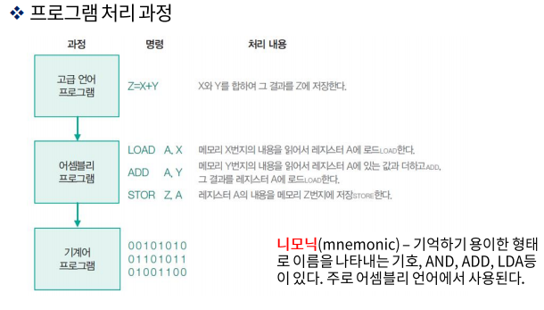

# 중앙처리장치 - 기본 컴퓨터 프로그래밍

### 프로그래밍 일반

일반적으로 컴퓨터는 하드웨어와 소프트웨어로 구성된다고 한다. 지금껏 우리가 학습했던 하드웨어를 잘 동작 시킬 수 있도록 제어하고, 지시하는 모든 종류의 프로그램을 소프트웨어라 하고, 소프트웨어는 또 크게 시스템 소프트웨어와 응용 소프트웨어로 나눌 수 있따.

- 프로그램 처리 과정
  - 프로그램을 작성하는 일은 일련의 기계 명령어를 직,간접적으로 기술하는 행위로 컴퓨터 내부의 기계어는 이진 형태의 의미 파악이 힘든 형태로 구성되어 있어 프로그래머는 영자 숫자 형태의 기호로 프로그램을 작성하는 것이 더욱 편리하다.
  - 하지만 기계는 이러한 형태의 사용자 위주 프로그래밍 언어를 이해 할 수 없기에, 이 기호 프로그램의 내용을 하드웨어가 인지 할 수 있는 이진 프로그램으로 옮길 필요가 있다. 

### 기계어

프로그램이란 컴퓨터로 하여금 원하는 데이터 처리 업무를 시행시키기 위해서 작성된 명령어 또는 문장으로 구성된 리스트이며 다음과 같은 종류가 있다.

- 이진 코드 - 메모리상에 나타나는 형태의 명령어로서 이진수 명령어와 피연산자의 시퀀스이다.
- 8/16 - 이진수 코드를 편의상 8/16진수형태로 표현한 내용
- 기호코드 - 사용자가 연산 부분, 주소 부분 등에 대하여 기호(문자, 숫자, 특수 문자 등)을 사용하게 되며, 각 기호 명령어는 하나의 이진 코드로 번역되는데 이러한 번역을 어셈블러가 담당

- 고급 프로그래밍 언어 - 컴퓨터 하드웨어의 동작을 염두에 두지 않고 문제해결에 관점을 맞춰서 개발한 인간 중심의 언어 C, C#, Java등이 대표적 사용 언어들이다. 이러한 부류의 언어를 컴파일러형 언어라고 한다.

### 어셈블리 언어

프로그래밍 언어는 일정한 규칙에 의해서 정의되므로 작성된 프로그램이 정확히 번역되기 위해서는 그 언어의 형식 규정을 잘 지켜야 한다. 모든 컴퓨터는 각각의 어셈블리 언어를 가지고 있으며 이들에 대한 규칙 등은 컴퓨터 제조 업체로부터 출판되어진다.

- 어셈블리어의 언어 규칙
  - 라벨 필드 -> 기호 주소를 나타내거나 빈칸이 될 수도 있다.
    - 기호주소는 세 개 이하의 영자숫자들로 구성, 첫 자는 문자여야 함
  - 명령어 필드 -> 기계 명령어나 슈도 명령어를 기술
    - 메모리 참조 명령어(MRI)
    - 레지스터 참조 또는 입출력 명령어
    - 수도 명령어
  - 코멘트 필드 -> 명령어에 대한 주석이나 해설을 하거나 불필요한 경우 생략도 가능

